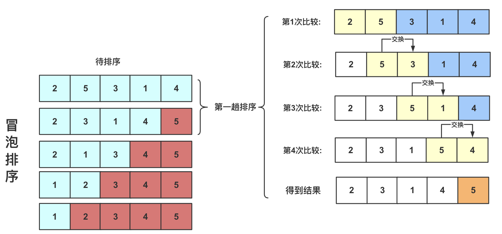
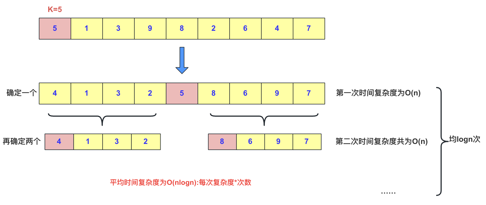
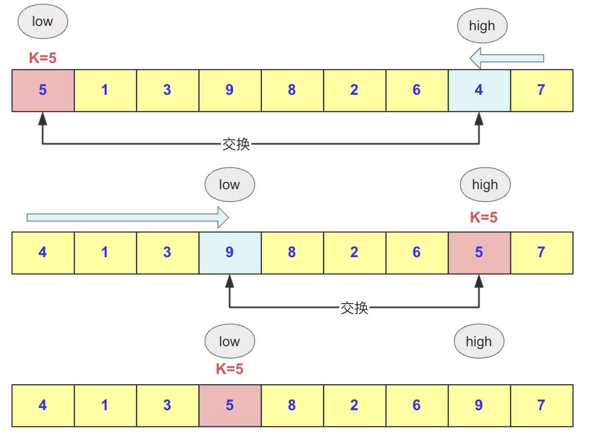
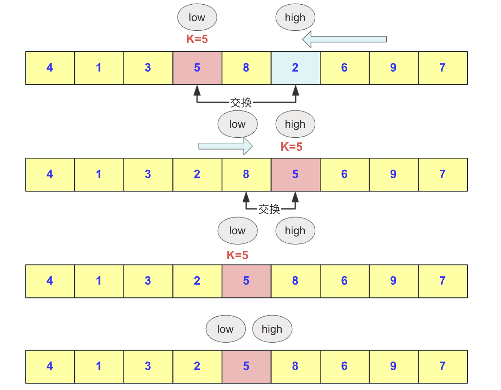

### 前言

在排序中，**冒泡和快排是考察最多**的了，不过冒泡要比快排还是简单很多，冒泡排序理解起来也算得上是最简单的排序算法之一，而快排的话很多面试笔试都是**要求手撕**的，重要性不言而喻。

当然，对于排序算法我当初首次接触学习的时候是萌萌懂懂的，只是大概了解，死记了模板，能将快排手写出来，刷题用。后来我发现我太傻吊了，Java中明明有Arrays.sort()这个api可以直接调用我为啥要憨呼呼的手写？多个条件排序重写下comparator接口就OK为啥还要憨呼呼的手写？。。。自此，又不会手写快排了。


现如今，被我重新拾起，深入理解下，**防止哪一天又那个大佬让我手撕下不会就尴尬了哈哈**，把学习过程分享给大家！

### 冒泡排序

#### 介绍

冒泡排序，又称起泡排序，是一种基于交换的经典排序算法，也是快速排序思想的基础。冒泡排序的名称来源于其排序过程中，较小的元素会逐渐“浮”到数列的顶端（升序或降序排列），就如同碳酸饮料中二氧化碳的气泡最终会上浮到顶端一样，因此得名“冒泡排序”。


冒泡排序是一种稳定的排序算法，其时间复杂度为O(n^2)。其基本思想是从前往后遍历数组，将较大的元素逐步往后调整（或者从后向前将较小的元素往前调整）。

#### 分析

具体思想为（以将大元素往后调整为例）：

1. 从第一个元素开始向后遍历，每到一个位置判断是否比后面的元素大。如果比后面元素大，就交换两者大小，然后继续向后；否则直接向后前进。这样的一轮操作可以确保最大的元素被交换到数组末尾。
2. 第二次同样从开始位置向后判断前进，如果当前位置比后面一个位置更大，则和后面的数交换。这次无需判断到最后，只需判断到倒数第二个位置即可（因为第一轮已经确定最大的在倒数第一，此轮目的是确定倒数第二）。
3. 以此类推，直到第一个元素使得整个数组有序。

冒泡排序是一种简单直观的排序算法，但由于其时间复杂度较高，对于大规模数据排序效率较低。在实际应用中，更倾向于使用内置的排序函数（例如Java中的`Arrays.sort()`），避免手写排序算法，特别是在处理大数据量时。然而，理解冒泡排序的原理仍然对于深入学习排序算法和理解基本排序思想具有重要意义。

拿个例子来说，比如`2，5，3，1，4`这个序列的冒泡排序，它的逻辑流程是这样的(就是交换、交换)：




#### 代码
在具体实现的时候，要分清是从小到大还是从大到小，还有次数也要注意，**谨防越界**！
至于冒泡排序的关键代码为：

```java
import java.util.Arrays;

public class BubbleSort {

    public static void main(String[] args) {
        int[] array = {2, 5, 3, 1, 4};

        System.out.println("排序前: " + Arrays.toString(array));

        bubbleSort(array);

        System.out.println("排序后 " + Arrays.toString(array));
    }

    static void bubbleSort(int[] array) {
        int n = array.length;
        for (int i = 0; i < n - 1; i++) {
            for (int j = 0; j < n - i - 1; j++) {
                if (array[j] > array[j + 1]) {
                    // swap temp and array[i]
                    int temp = array[j];
                    array[j] = array[j + 1];
                    array[j + 1] = temp;
                }
            }
        }
    }
}

```

### 快速排序

#### 介绍
快速排序是对冒泡排序的一种改进，采用递归分治的方法进行求解。相较于冒泡排序，快速排序是一种不稳定排序，其时间复杂度在最坏情况下为O(n^2)，但平均时间复杂度为O(nlogn)，最好情况下为O(nlogn)。

#### 分析
对于快排来说，**基本思想**是这样的

快速排序的基本思想是通过递归分治，将序列划分为两个部分：左侧的元素都小于一个基准数，右侧的元素都大于这个基准数。然后对左右两个部分分别进行快速排序，以此类推，直到整个序列有序。

其中这个数在这个序列中是可以随机取的，可以取最左边，可以取最右边，当然也可以取随机数，但是**通常**我们取最左边的那个数。



这里的一个难题就是**如何处理将比第一个数K小的全部放左面，把比K大的全部放右面**！如果没有什么技巧，直接硬性往里面塞，那么整个时间复杂度和空间复杂度会比较高。我们为了节省计算机资源，采取这样的方法：
1. 选择一个基准数（通常选择序列的第一个数）。
2. 从右往左找到第一个比基准数小的元素，将其放到基准数的位置。
3. 从左往右找到第一个比基准数大的元素，将其放到刚刚空出的位置。
4. 重复步骤2和步骤3，直到左右指针相遇。
5. 将基准数放到左右指针相遇的位置，此时基准数左侧的元素都小于基准数，右侧的元素都大于基准数。
6. 对基准数左右两侧的子序列分别进行递归快速排序。


让我们来一步一步地进行快速排序，以序列 `5 1 3 9 8 2 6 4 7` 为例。

1. **选择基准数：** 初始时，选择序列的第一个数作为基准数，即5。

2. **从右往左找到第一个比基准数小的数：** 从右往左遍历，找到第一个比基准数5小的数，即4。

3. **交换位置：** 将4放到基准数5的位置，得到序列 `4 1 3 9 8 2 6 5 7`。

4. **从左往右找到第一个比基准数大的数：** 从左往右遍历，找到第一个比基准数5大的数，即9。

5. **交换位置：** 将9放到刚刚空出的位置，得到序列 `4 1 3 5 8 2 6 9 7`。

   

6. **重复步骤2和步骤3：** 重复以上步骤，继续从右往左找到比基准数小的数，从左往右找到比基准数大的数，并交换它们的位置。直到左右指针相遇。

   - 找到比基准数5小的数是2，将2放到基准数5的位置，得到序列 `4 1 3 2 8 5 6 9 7`。

   - 找到比基准数5大的数是8，将8放到刚刚空出的位置，得到序列 `4 1 3 2 5 8 6 9 7`。

   - 左右指针相遇，将基准数5放到相遇的位置，得到序列 `4 1 3 2 5 8 6 9 7`。

   

7. **基准数左右两侧进行递归排序：** 此时，基准数5左侧的子序列是 `4 1 3 2`，右侧的子序列是 `8 6 9 7`。对这两个子序列进行递归快速排序。

   - 对左侧子序列 `4 1 3 2` 进行快速排序。
     1. 选择基准数4，重复步骤2到步骤6。
     2. 左侧子序列排序完成。
   - 对右侧子序列 `8 6 9 7` 进行快速排序。
     1. 选择基准数8，重复步骤2到步骤6。
     2. 左侧子序列排序完成。

8. **整个序列排序完成：** 继续递归排序左右子序列，直到每个子序列只有一个元素。最终得到完全有序的序列 `1 2 3 4 5 6 7 8 9`。


#### 代码
在书写代码的时候，要注意一些顺序，防止数组越界情况，可以写好debug一遍其实就很好理解了！当写代码遇到错误时候，不要急着就去找正确答案，能有时间自己发现错误，可以借助断点查看程序执行流程，这样对自己的收益是最大的！
至于快排的代码，是这样的：

```java
private static void quicksort(int [] a,int left,int right){
		int low=left;
		int high=right;
	    //下面两句的顺序一定不能混，否则会产生数组越界！！！very important！！！
		if(low>high)//作为判断是否截止条件
			return;
		int k=a[low];//额外空间k，取最左侧的一个作为衡量，最后要求左侧都比它小，右侧都比它大。
		while(low<high){//这一轮要求把左侧小于a[low],右侧大于a[low]。
			while(low<high&&a[high]>=k){//右侧找到第一个小于k的停止
				high--;
			}
			//这样就找到第一个比它小的了
			a[low]=a[high];//放到low位置
			while(low<high&&a[low]<=k){//在low往右找到第一个大于k的，放到右侧a[high]位置
				low++;
			}
			a[high]=a[low];			
		}
		a[low]=k;//赋值然后左右递归分治求之
		quicksort(a, left, low-1);
		quicksort(a, low+1, right);		
}
```


## 结语

好了这个交换类排序就总结到这里了。总之，冒泡是很基础和容易，但是要注意这种简单排序所属的范畴(交换类)要和插入类等做好区分；而快排板子很好记，深入理解需要点时间消化吧。一次不行再来第二次，不行再来第三次，，**再不行就放弃(手动滑稽)**。

