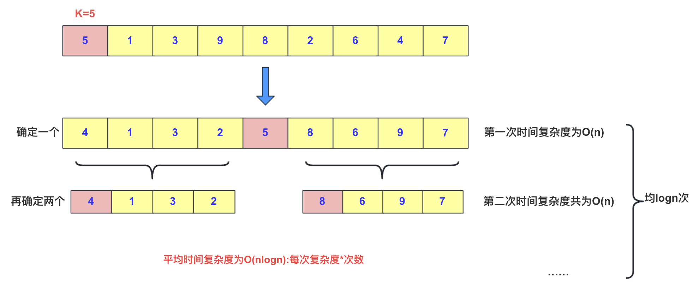
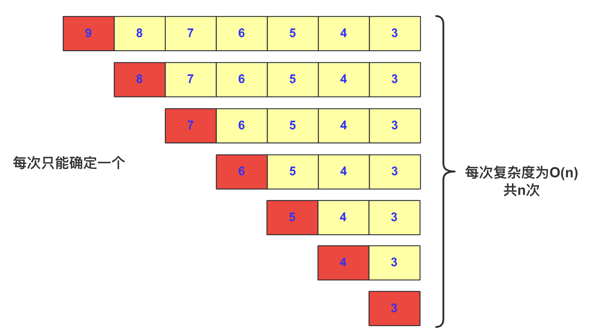
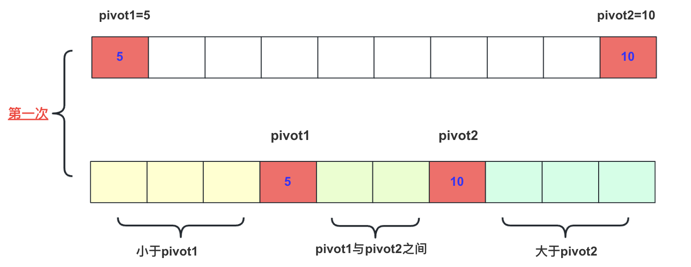
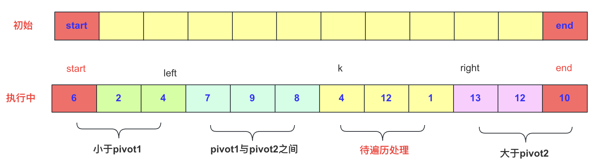
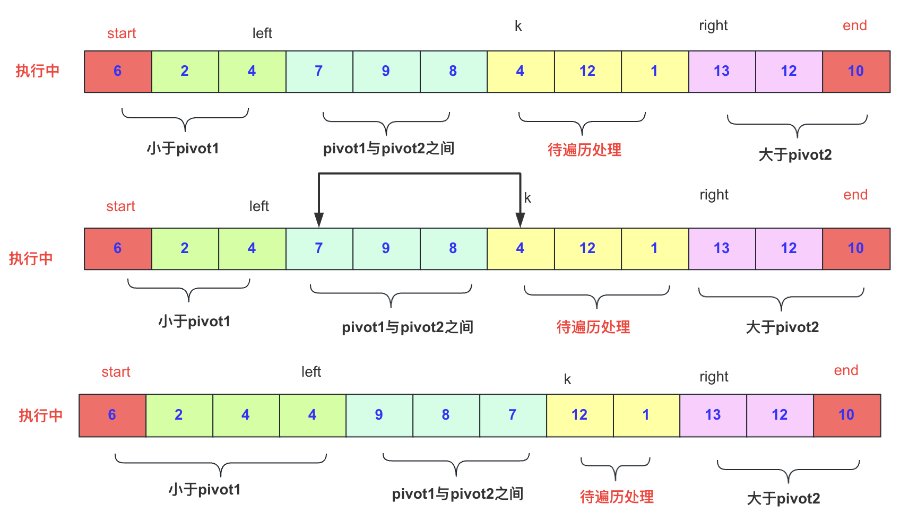
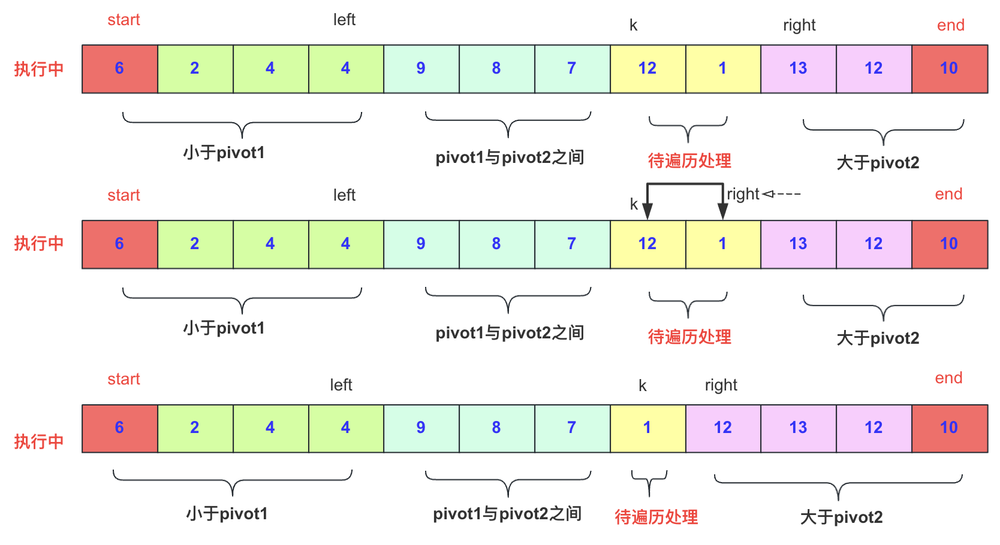
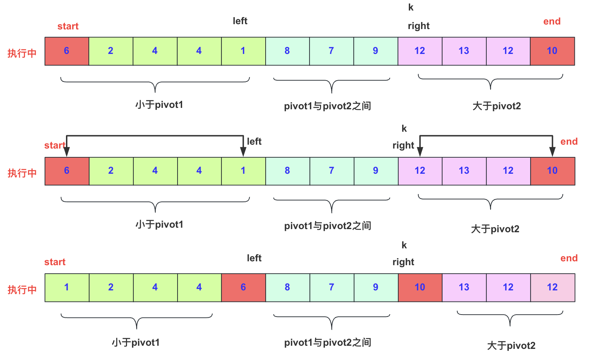

### 前言

在排序算法中，快排是占比非常多的一环，但是快排其思想一直被考察研究，也有很多的优化方案。这里主要讲解双轴快排的思想和实现。

首选，双轴快排也是一种快排的优化方案，在JDK的Arrays.sort()中被主要使用。所以，掌握快排已经不能够满足我们的需求，我们还要学会双轴快排的原理和实现才行。

### 回顾单轴快排

单轴快排也就是我们常说的普通快速排序，对于快速排序我想大家应该都很熟悉：基于递归和分治的，时间复杂度最坏而O(n2),最好和平均情况为O(nlogn).

而快排的具体思路也很简单，每次在待排序序列中找一个数(通常最左侧多一点)，然后在这个序列中将比他小的放它左侧，比它大的放它右侧。



如果运气肯不好遇到O(n2)的，就是遇到有序的序列会出发这种情况：



实现起来也很容易，这里直接贴代码啦：

### 双轴快排分析

今天我们将深入探讨双轴快速排序算法。相较于单轴快排，双轴快排引入了两个主元素，旨在提高性能并减少在某些情况下可能出现的最坏情况。在单轴快排中，由于选择的轴元素可能是整个数组中的最大或最小值，导致排序性能下降，时间复杂度为 O(n^2)。

#### 双轴快排概述

双轴快排通过选择两个主元素，即 `pivot1` 和 `pivot2`，将待排序区间划分为三部分。这样一来，每次划分的元素个数增至两个，将区间划分为左、中、右三个部分。尽管最坏情况下左右两侧元素都与 `pivot1` 和 `pivot2` 相等，但这种情况的概率相较于单轴情况要低得多，因此双轴快排在某些情况下能够更好地优化排序性能。

#### 执行流程详解

双轴快排的执行流程可以通过一系列图示来解释。

首先，在初始情况下，我们选择待排序区间内最左侧和最右侧的两个元素作为 `pivot1` 和 `pivot2`。为了保证算法稳定性，我们会提前处理数组，确保 `pivot1` 小于 `pivot2`。



每一轮的目标是确保比 `pivot1` 小的元素位于左侧，比 `pivot2` 大的元素位于右侧，而介于两者之间的元素位于中间，每一轮确定两个元素位置然后递归执行子区间排序即可。



#### 一趟交换过程

在遍历和交换过程中，我们使用三个参数 `left`、`right` 和 `k`，其中 `left` 初始为 `start`，表示小于 `pivot1` 的区域的结束位置；`right` 初始为 `end`，表示大于 `pivot2` 的区域的结束位置；`k` 初始为 `start+1`，表示从左向右遍历的指针。

1. 如果 `arr[k] < pivot1`(注意这里的)，则先增加 `left`，然后交换 `arr[k]` 和 `arr[left]`，并将 `k` 自增。



2. 如果 `arr[k] > pivot2`，说明这个想在最右侧right位置交换一下，但是需要考虑right位置是否也是大于`pivot2`，所以需要减少 `right`一直到`arr[right]`<=`pivot2` 满足在两个中间然后交换 `arr[k]` 和 `arr[right]`，注意此时 `k` 不自增，因为交换后的 `arr[k]` 需要再次与`pivot1`比较(可能小还要到左侧交换呢)。



3. 如果介于两者之间，只需将 `k` 自增即可。

#### 收尾工作

在执行完这一趟即k=right之后，即开始需要将pivot1和pivot2的数值进行交换

```
swap(arr, start, left);
swap(arr, end, right);
```




然后三个区间根据编号递归执行排序函数即可。


### 代码总结

在这里，分享下个人实现双轴快排的代码：

```java
import java.util.Arrays;

public class DualPivotQuickSort {

    public static void main(String[] args) {
        int a[]= {7,3,5,4,8,5,6,55,4,333,44,7,885,23,6,44};
        dualPivotQuickSort(a,0,a.length-1);
        System.out.println(Arrays.toString(a));
    }

    private static void dualPivotQuickSort(int[] arr, int start, int end) {
        if(start>end)return;//参数不对直接返回
        if(arr[start]>arr[end])
            swap(arr, start, end);
        int pivot1=arr[start],pivot2=arr[end];//储存最左侧和最右侧的值
        //(start，left]:左侧小于等于pivot1 [right,end)大于pivot2
        int left=start,right=end,k=left+1;
        while (k<right) {
            //和左侧交换
            if(arr[k]<pivot1) {
                //需要交换
                swap(arr, ++left, k++);
            } else if (arr[k]<=pivot2) {//在中间的情况
                k++;
            } else {
                while (arr[right]>pivot2) {//如果全部小于直接跳出外层循环
                   right--;
                }
               if(k>=right)break ;
                swap(arr, k, right);
            }
        }
        swap(arr, start, left);
        swap(arr, end, right);
        dualPivotQuickSort(arr, start, left-1);
        dualPivotQuickSort(arr, left+1, right-1);
        dualPivotQuickSort(arr, right+1, end);
    }
    static void swap(int arr[],int i,int j) {
        int team=arr[i];
        arr[i]=arr[j];
        arr[j]=team;
    }
}
```

执行结果为：

```
[3, 4, 4, 5, 5, 6, 6, 7, 8, 23, 44, 44, 7, 55, 333, 885]
```

这里单看代码可能比较绕，需要代码和流程结合着看。

其实整体思路就是递归分治进行，然后每一轮选两个数进行。

其实进行时候有四个区间，【比第一个数小】【两者之间】【正在枚举处理的】【比第二个大】，这里面要注意数值范围，避免同一个数可能出现在两个区间，所以两侧严格小和大(不要搞混等于号)。

主要遍历【正在枚举处理的】区间，如果发现比第一个pivot1还小，那么要跟【两者之间】第一个数交换，相当于这个【两者之间】**右侧平移一格**。

如果发现比pivot2还大，说明要放到最右侧啊，但是【正在枚举处理的】【比第二个大】相邻所以要判断【比第二个大】最左侧哪一个开始比pivot2小，这个其实就是在【正在处理的】内部交换了，换完最右侧就属于【比第二个大】的区间了，然后此时不需要右侧移动枚举【正在枚举处理的】，刚交换完数值小于pivot2也可能比pivot1还小，所以要再走一轮重新判断一下。

这个描述可能不是很严谨但是表达大概意思，可以对着图看一下，有疑问再对一下。

