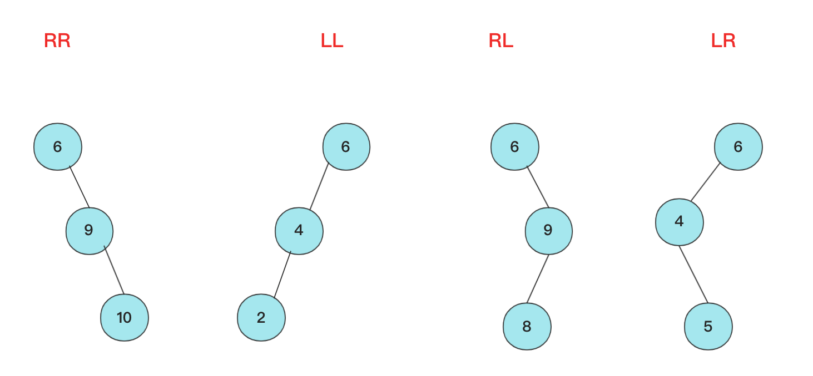
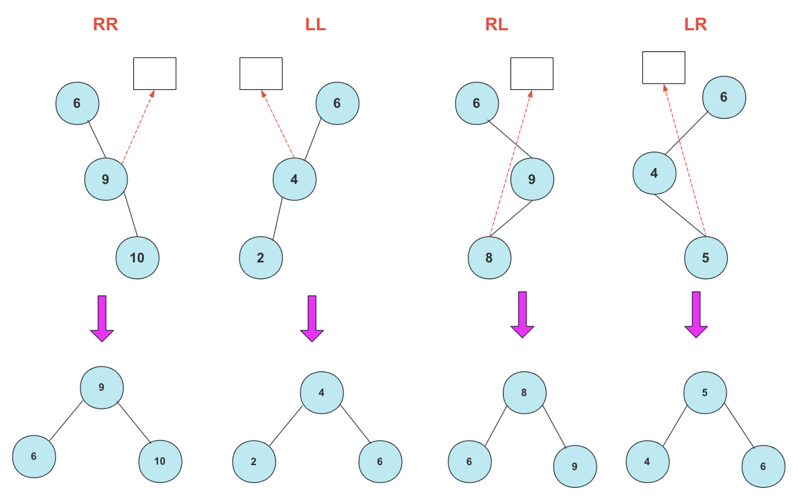
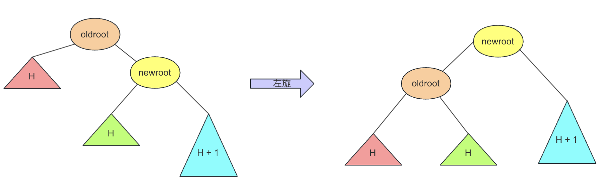
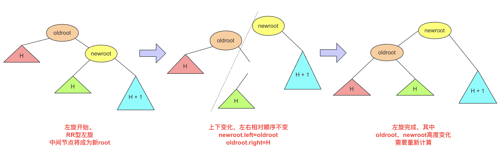
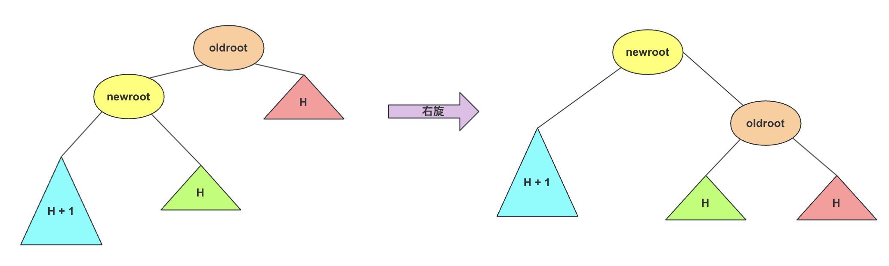
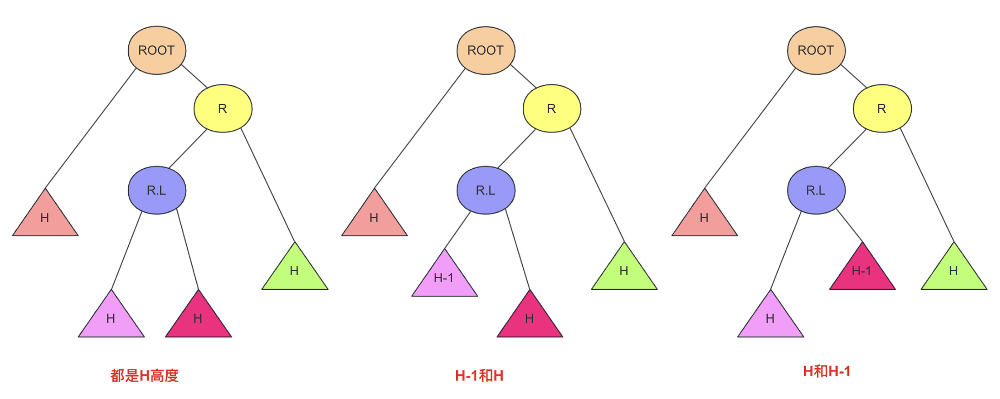
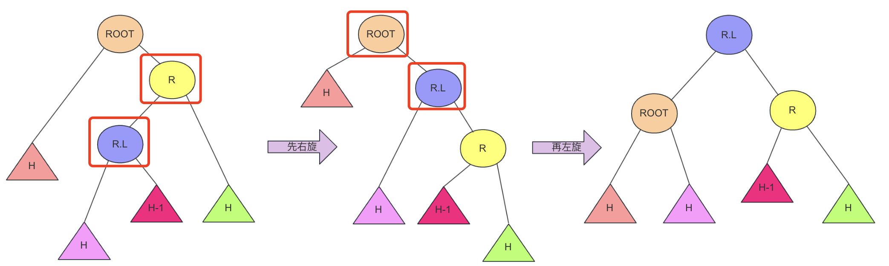
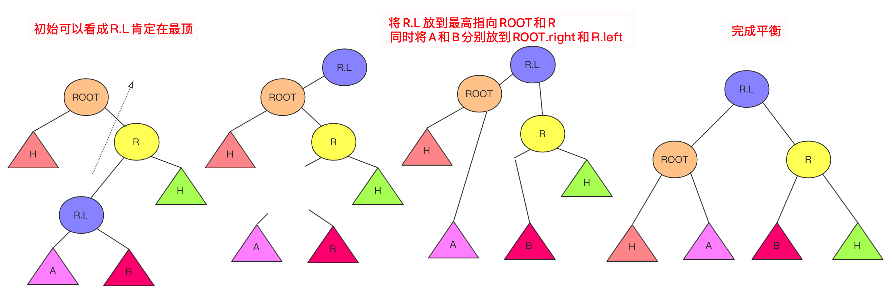
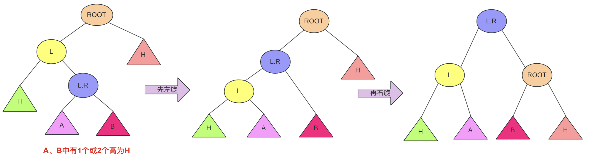

### 什么是ALV树


对于树这种数据结构，我们通常将其分为二叉树和多叉树两大类。在二叉树中，我们熟知的包括二叉搜索树、二叉平衡树、伸展树、红黑树等。多叉树中，经典的例子有B树和字典树。

二叉搜索树具有这样的特点：每个节点都有左孩子和右孩子，且左侧节点值小于父节点值，右侧节点值大于父节点值。这样的特性就使得二叉搜索树在数值查找方面有一些价值，比较好的查找情况时间复杂度是O(logn)。

然而，二叉搜索树存在一个明显的问题：当插入节点的顺序过于有序时，很容易导致树形成斜树或深度较高的情况，使得查找效率趋近于线性O(n)。

为了解决这一问题，人们希望二叉树能够保持插入节点时的有序性，即小的节点在左侧，大的节点在右侧，但又避免出现斜树那么离谱的情况。这就引出了对平衡性的需求，即希望树的结构能够在插入操作后自动保持平衡，以提高整体的查找效率。这需求推动了平衡二叉树的概念，它们通过一系列规则和旋转操作来确保树的平衡性，从而兼顾了有序性和高效查找的要求。


这不，平衡二叉搜索(AVL)树就是这么干的，AVL树在插入的时候每次都会旋转自平衡，让整个树一直处于平衡状态，让整个树的查询更加稳定(logN)。我们首先来看一下什么是ALV树：

- AVL树是**带有平衡条件的二叉搜索树**，左右子树的高度差（平衡因子）不大于1，并且它的每个子树也都是平衡二叉树。

对于平衡二叉树节点的最小个数求法，类似求斐波那契：

```
节点个数=F(h)=F(h−1)+F(h−2)+1
F(0)=0
F(1)=2
```

其中，`F(h)` 表示高度为 h 的平衡二叉树的最小节点个数，`F(h−1)` 表示高度为 h-1 的平衡二叉树的最小节点个数，`F(h−2)` 表示高度为 h-2 的平衡二叉树的最小节点个数。

基本上，这个公式是一个斐波那契数列的变种,通过递归关系计算出高度为 h 的最小节点个数。

一个更直观的解释是：对于一棵平衡二叉树，每个节点都有左右两个子节点，因此高度为 h 的树至少包含高度为 h-1 和 h-2 的两个子树，再加上根节点，所以节点个数可以表示为左右子树节点个数之和再加1。

难点：AVL是一颗二叉排序树，用什么样的规则或者规律让它能够在**复杂度不太高**的情况下**实现动态平衡**呢？


### 不平衡情况

如果从简单情况模型看，其实四种不平衡情况很简单，分别是RR,LL,RL,LR四种不平衡情况。




然后将其平衡的结果也很容易(不考虑其附带节点只看结果)，将中间大小数值移动最上方，其他相对位置不变即可：




当然，这个仅仅是针对三个节点情况**太过于理想化**了，很多时候树的结构比较复杂有较多子节点和父节点，我们需要针对整个流程梳理一下如何保持一个二叉平衡树。


首先，刚开始树是平衡的。

前面的若干次操作，都是平衡的，然后可能因为某一次操作突然使得这个AVL树不满足(每个节点)，然后我们就要详细思考一下这次操作需要怎么搞。

插入可以采用一个递归的方式(如果不采用递归可能会借助一个新的父节点去实现)，然后在递归向下的时候，我们正常的插入节点。

**被插入的那个节点**，因为没有儿子节点，所以肯定是满足平衡条件的，然后后面就进入递归回去的过程，回去的过程中，需要对每个节点更新深度，并且判断当前节点是否平衡，如果不平衡，需要将节点平衡了然后继续，至于细节，下面详细介绍。


### 四种不平衡情况处理

针对四种不平衡的情况，这里对每种情况进行详细的讲解。

#### RR平衡旋转(左单旋转)

到达递归oldroot时候发现不平衡了(左右子孩子都是平衡的)，这里的RR指的是节点模型的样子，其含义是需要左单旋转(记忆时候需要注意一下RR不是右旋转)！




出现这种情况的原因是节点的**右侧的右侧较深**这时候不平衡节点需要左旋，再细看过程。

我们分析一下这种情况：可能新插入节点在newroot右侧，然后newroot也满足平衡，左右的深度分别为H和H+1。

但是此时oldroot左侧依然是H，但是右侧已经变成H+2，显然不满足但是差距又不大(刚开始出现不平衡的情况说不定微调就可以)。

这里也是一棵二叉排序树哦，根节点数值大小顺序为：

> 红H < oldroot < 绿H < newroot < 蓝色H+1

所以调整平衡这里面newroot作为根做合理，然后比它小的都要放到左侧，刚好oldroot作为左儿子那么它的右侧空出来，这个绿H刚好满足在它右侧，这样调整就满足左单旋转了。在执行完毕只有**oldroot和newroot的高度**发生了变化，其他节点高度未发生变化。


其更详细流程为：



#### LL平衡旋转(右单旋转)

而右旋和左旋相反，但是思路相同，根据上述进行替换即可！




#### RL平衡旋转(先右后左双旋转)

这个RL你可能有点懵圈，为啥RR叫左旋，LL叫右旋，这个RL怎么就叫先右后左旋转了？

别急别急，这个之所以先右后左，是因为具体需要中间节点右旋一次，然后上面节点左旋一次才能平衡，具体可以下面慢慢看。

首先产生这种不平衡的条件原因是：

仅有当前ROOT不平衡，且是ROOT.right.left这个节点深了一些(这个节点可能有个节点深一点或者两个节点都深一点)，例如下面三种情况：



但其实并不影响，还是因为`R.L`这个节点深了一些。平衡方式的其实可以窥见：root和橙色H高度H+1，R和绿色H高度为H+1，这两个节点分别放在`R.L`左右，然后接上`R.L`本身的两个孩子，这样刚好平衡且满足条件。

该怎么做呢？

两次上浮，之前左旋右旋一次操作可以上浮平衡一位，这次先对R进行右旋操作，`R.L`上浮到ROOT右侧，此时右侧变深了满足RR左单旋转情况，对root开始左旋，就完成操作实现平衡。



**思路(个人方法)2：直接分析**

根据初始和结果的状态，然后分析各个节点变化顺序=，手动操作这些节点即可。其实不管你怎么操作，只要能满足**最后结构一致**就行啦！

首先根据`ROOT`,`R`,`R.L`三个节点变化，`R.L`肯定要在最顶层，左右分别指向ROOT和R，那么这其中`R.left`，`ROOT.right`发生变化(原来分别是R.L和R)暂时为空。而刚好根据**左右大小关系**可以补上`R.L`原来的孩子节点`A`，`B`。




#### LR平衡旋转(先左后右双旋转)

这个情况和RL情况相似，采取相同操作即可。

根据上述RL修改即可




### 代码实现

首先对于节点多个`height`属性。用于计算高度(平衡因子)


```java
public class AVLTree {
    class TreeNode {
        int value;
        int height; // 节点的高度，用于平衡因子计算
        TreeNode left;
        TreeNode right;

        public TreeNode(int value) {
            this.value = value;
            this.height = 1; // 初始高度为1
            this.left = null;
            this.right = null;
        }
    }
    private TreeNode root;

    // 获取节点的高度
    private int height(TreeNode node) {
        return (node != null) ? node.height : 0;
    }

    // 计算平衡因子
    private int getBalanceFactor(TreeNode node) {
        return (node != null) ? height(node.left) - height(node.right) : 0;
    }

    // 更新节点的高度
    private void updateHeight(TreeNode node) {
        if (node != null) {
            node.height = 1 + Math.max(height(node.left), height(node.right));
        }
    }

    // 右旋转操作 返回操作完的新节点
    private TreeNode rightRotate(TreeNode oldRoot) {
        TreeNode newRoot = oldRoot.left;
        TreeNode temp = newRoot.right;

        // 执行旋转
        newRoot.right = oldRoot;
        oldRoot.left = temp;

        // 更新节点高度 其他节点的高度并没有更新
        updateHeight(oldRoot);
        updateHeight(newRoot);

        // 返回新的根节点
        return newRoot;
    }

    // 左旋转操作 返回操作完的新节点
    private TreeNode leftRotate(TreeNode oldRoot) {
        TreeNode newRoot = oldRoot.right;
        TreeNode temp = newRoot.left;

        // 执行旋转
        newRoot.left = oldRoot;
        oldRoot.right = temp;

        // 更新节点高度 先更新低层的
        updateHeight(oldRoot);
        updateHeight(newRoot);

        // 返回新的根节点
        return newRoot;
    }

    // 插入节点
    public void insert(int value) {
        root = insert(root, value);
    }

    // 辅助方法：插入节点（递归）
    private TreeNode insert(TreeNode node, int value) {
        // 执行标准BST插入
        if (node == null) {
            return new TreeNode(value);
        }

        if (value < node.value) {
            node.left = insert(node.left, value);
        } else if (value > node.value) {
            node.right = insert(node.right, value);
        } else {
            // 重复值不允许插入（可以根据实际需求进行调整）
            return node;
        }

        // 更新节点的高度
        updateHeight(node);

        // 获取平衡因子
        int balance = getBalanceFactor(node);

        // 进行平衡操作
        // 左子树比右子树高，需要右旋转
        if (balance > 1 && value < node.left.value) {
            return rightRotate(node);
        }
        // 右子树比左子树高，需要左旋转
        if (balance < -1 && value > node.right.value) {
            return leftRotate(node);
        }
        // 左右不平衡，先左旋后右旋
        if (balance > 1 && value > node.left.value) {
            node.left = leftRotate(node.left);
            return rightRotate(node);
        }
        // 右左不平衡，先右旋后左旋
        if (balance < -1 && value < node.right.value) {
            node.right = rightRotate(node.right);
            return leftRotate(node);
        }

        return node;
    }

    // 中序遍历（用于验证树的平衡性）
    public void inOrderTraversal(TreeNode node) {
        if (node != null) {
            inOrderTraversal(node.left);
            System.out.print(node.value + " ");
            inOrderTraversal(node.right);
        }
    }

    public static void main(String[] args) {
        AVLTree avlTree = new AVLTree();

        // 插入一些节点
        avlTree.insert(10);
        avlTree.insert(20);
        avlTree.insert(30);
        avlTree.insert(40);
        avlTree.insert(50);
        avlTree.insert(25);

        // 中序遍历输出，验证平衡性
        avlTree.inOrderTraversal(avlTree.root);
    }
}
```


AVL的理解需要时间，当然笔者的AVL自己写的可能有些疏漏，如果有问题还请各位一起探讨！

当然，除了插入，AVL还有删除等其他操作，(原理相似。删除后平衡)有兴趣可以一起研究。


