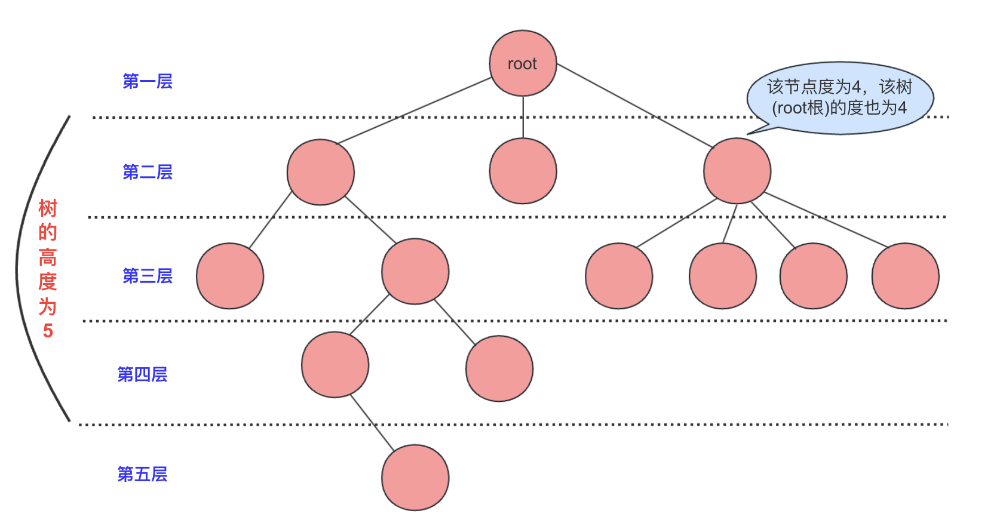
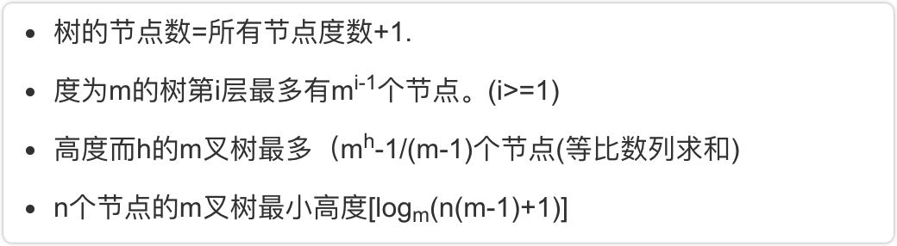
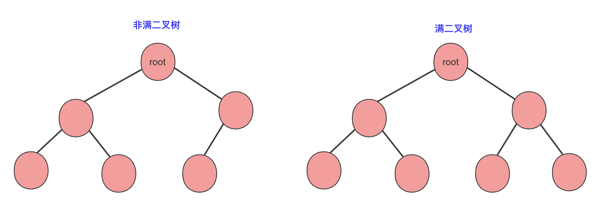
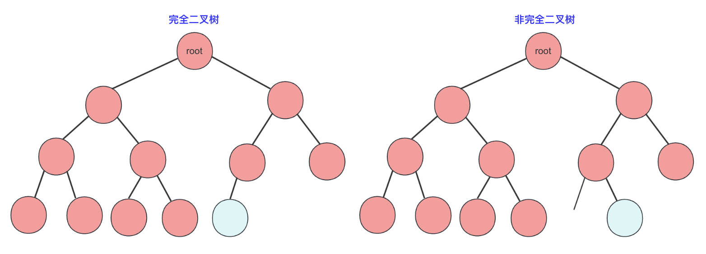
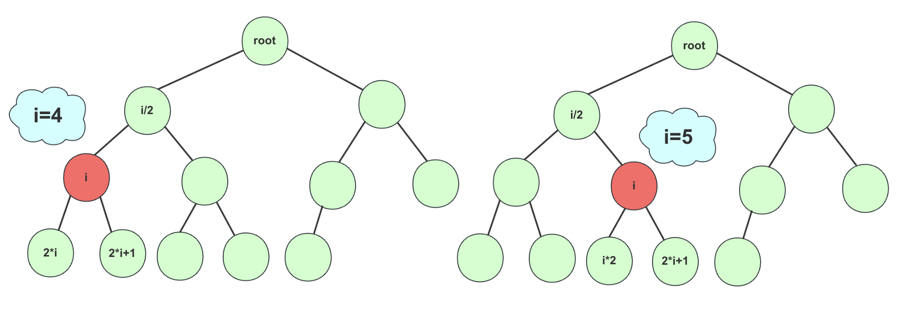
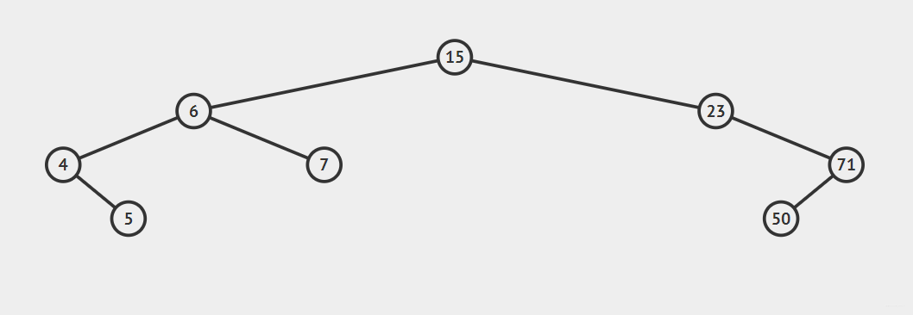
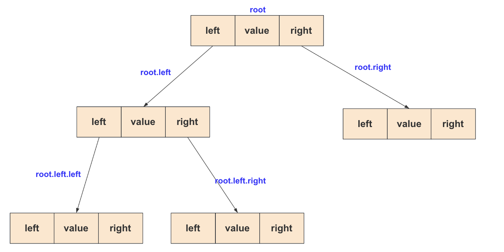
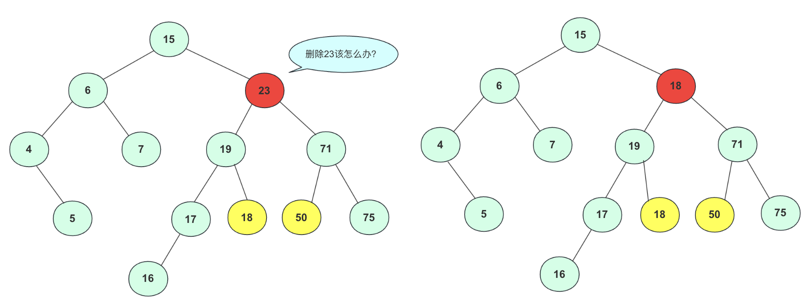
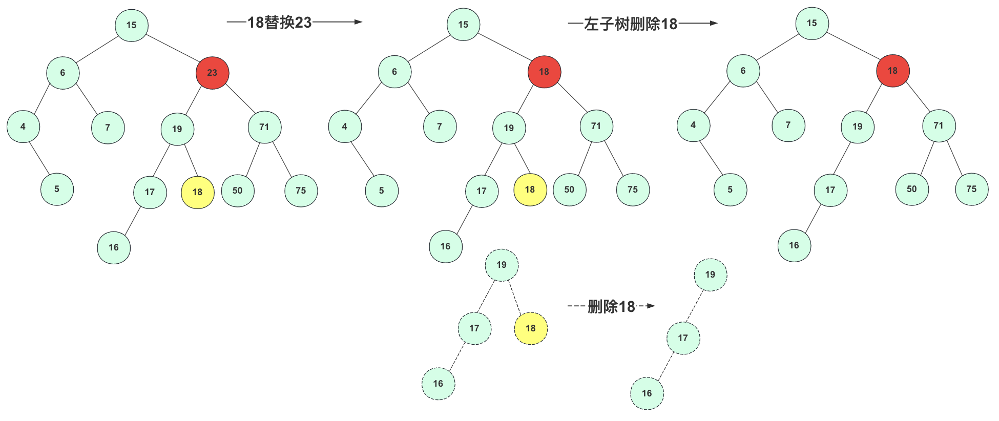

### 前言	

在数据结构与算法中，树是一个比较大的家族，家族中有很多厉害的成员，从大的角度可以分为二叉树和多叉树(B树)，但是二叉树在平时接触可能更多一些。二叉树中又分为普通二叉树、二叉排序树、二叉平衡树、红黑树等等，其中二叉排序树可以刚刚满足搜索的使用需求，所以还是有学习必要的。

对于二叉排序树而言，本章重点关注其实现方式以及插入、删除步骤流程，我们会手写一个二叉排序树，二叉树遍历部分的内容比较多会单独详细讲解。                                                                              

### 什么是树

树是一种数据结构，它是由n(n>=1)个有限结点组成一个具有层次关系的集合。把它叫做"树"是因为它看起来像一棵倒挂的树，也就是说它是根朝上，而叶朝下的。




 树是递归的，将树的任何一个节点以及节点下的节点都能组合成一个新的树，所以树的很多问题都是使用递归去完成。

 **根节点**： 顶层节点被称为根节点，它不具有父节点，只包含子节点（可以是0个或多个）。

 **层数：** 通常，我们将根节点视为第1层（有些人也将其称为第0层），而树的高度是指具有最高层数的节点的层数（在下文的示意图中，层数从1开始计数）。

 **节点关系:**

 -  父节点：连接到该节点的上一层节点。
 -  孩子节点: 和父节点对应，上下关系。而祖先节点是父节点的祖先节点(或者父节点）。
 -  兄弟节点：拥有相同父节点的节点互称为兄弟节点。

**节点的度:** 就是节点拥有**孩子节点**的个数(是直接连接的孩子不是子孙)。

**树的度:** 就是所有节点中最大 **(节点的度)**。同时，如果度大于0的节点是分支节点,度等于0的节点是叶子节点（没有子孙）。

**相关性质**：



### 二叉树

二叉树是树的一种，但应用比较多，每个节点最多只有两个子节点(但不一定非得要有两个节点)。

**二叉树与度为2的树的**区别：
 1、度为2的的树必须有三个节点以上(否则就不叫度为2了，一定要先存在)，二叉树可以为空。
 2、二叉树的度不一定为2,比如**斜树**。
 3、二叉树有左右节点区分，而度为2的树没有左右节点的区分。

**几种特殊二叉树：**

**满二叉树**：高度为n的满二叉树有(2^n) -1个节点。



**完全二叉树**：上面一层全部满，最下一层从左到右顺序排列。



二叉排序树：树按照一定规则插入排序(本文详解)。
平衡二叉树：树上任意节点左子树和右子树深度差距不超过1(后文详解)。

**二叉树性质：**

二叉树遵循树的所有性质，此外还有一些特有属性：

- 非空二叉树叶子节点数=度为2的节点数+1：本来一个节点如果度为1.那么一直延续就一个叶子，但如果出现一个度为2除了延续原来的一个节点，会多出一个节点需要维系，所以到最后会多出一个叶子。

- 非空第i层最多有2^(i-1)个节点。

- 高为h的树最多有(2^h)-1个节点(等比求和)。

二叉树一般用链式存储，这样内存利用更高，但二叉树也可以用数组存储的(经常会遇到)，各个节点对应的下标是可以计算出来的：

- 根节点的索引为0。
- 如果一个节点的索引为i，它的左子节点的索引为2i + 1，右子节点的索引为2i + 2。
- 如果一个节点的索引为i，它的父节点的索引为(i - 1) / 2（向下取整）。

就拿一个完全二叉树若从左往右，从上到下编号如图：



### 二叉排序(搜索)树

#### 概念

前面铺垫那么多，咱们言归正传，详细讲解并实现一个二叉排序树，二叉搜索树拥有二叉树的性质，同时有一些自己的规则：

首先要了解二叉排序树的规则：**从任意节点开始，节点左侧节点值总比节点右侧值要小。** 

例如一个二叉排序树依次插入`15，6，23，7，4，71，5，50`会形成下图顺序



#### 构造

二叉排序树是由若干节点(node)构成的，对于node需要这些属性：left、right和value。其中left和right是左右指针指向左右孩子子树，而value是储存的数据，一般二叉树存储数字类型比较多，这里就用int不用泛型了。

`TreeNode`类构造为：

```java
public class TreeNode {
    int value;          // 节点的值
    TreeNode left;    // 左子节点的引用
    TreeNode right;   // 右子节点的引用

    public TreeNode(int value) {
        this.value = value;
        this.left = null;
        this.right = null;
    }
}
```




既然已经构造好一棵树，那么就需要实现主要的方法,因为二叉排序树中**每个节点都能看作一棵树**。所以我们创建方法的是时候加上节点参数(方便一些递归调用)，下面讲解插入、查找、删除操作，其实插入、查找操作很像但有点区别，这里就不封装到一起了。

#### 插入操作

插入操作用于将新的节点添加到二叉排序树中，以保持树的有序性。下面是插入操作的详细流程：

1. 从根节点开始，将要插入的值与当前节点的值进行比较。

2. 如果要插入的值小于当前节点的值，移动到当前节点的左子树；如果要插入的值大于当前节点的值，移动到当前节点的右子树。

3. 重复步骤 2，直到找到一个空的位置，即当前节点的左子树或右子树为空。

4. 在这个空位置插入新节点，其值为要插入的值。

5. 插入完成，树的有序性仍然保持。


这里给一个非递归的方法可以对照流程参考：

```java
public void insert(int value) {
    TreeNode newNode = new TreeNode(value);
    //如果root为null的特殊情况还是要尊重一下
    if (root == null) {
        root = newNode;
        return;
    }
    //开始表演
    TreeNode current = root;
    while (true) {
        if (value < current.value) {
            if (current.left == null) {//插在左侧
                current.left = newNode;
                return;
            }
            current = current.left;
        } else if (value > current.value) {
            if (current.right == null) {//插入右侧
                current.right = newNode;
                return;
            }
            current = current.right;
        } else {
            // 一般不存在这种情况 相同的没法插。
        }
    }
}
```


#### 查找操作

查找操作用于在二叉排序树中查找特定值是否存在。以下是查找操作的详细流程：

1. 从根节点开始，将要查找的值与当前节点的值进行比较。

2. 如果要查找的值等于当前节点的值，返回 true，表示找到了目标值。

3. 如果要查找的值小于当前节点的值，移动到当前节点的左子树。

4. 如果要查找的值大于当前节点的值，移动到当前节点的右子树。

5. 重复步骤 2、3、4，直到找到等于目标值的节点或遍历到一个空节点。

6. 如果遍历到一个空节点，返回 false，表示未找到目标值。

7. 查找完成，树的结构不变。

这里提供一个非递归的方法提供结合学习：

```java
public boolean search(int value) {
    TreeNode current = root;
    while (current != null) {
        if (value == current.value) {
            return true;
        } else if (value < current.value) {
            current = current.left;
        } else {
            current = current.right;
        }
    }
    // while 一直到null说明不存在
    return false;
}
```


#### 删除操作

删除操作用于从二叉排序树中移除特定值。以下是删除操作的详细流程：

1. 从根节点开始，将要删除的值与当前节点的值进行比较。

2. 如果要删除的值等于当前节点的值，有以下情况：

   a. 如果当前节点是叶子节点（没有子节点），直接删除该节点。

   b. 如果当前节点有一个子节点，用子节点替换当前节点。

   c. 如果当前节点有两个子节点，找到当前节点右子树的最小值（或左子树的最大值）来替代当前节点的值，然后删除那个最小值节点。

3. 如果要删除的值小于当前节点的值，移动到当前节点的左子树。

4. 如果要删除的值大于当前节点的值，移动到当前节点的右子树。

5. 重复步骤 2、3、4，直到找到等于目标值的节点或遍历到一个空节点。

6. 如果遍历到一个空节点，说明目标值不在树中，删除操作无效。

删除完成，树的有序性仍然保持。

这里面还要详细讲一下，不然估计很多人不明白，尤其是其中相等时候的b和c两种情况。

情况b的时候很好理解，删除节点只有一个孩子节点，直接给孩子节点**提上来**。


情况c稍微复杂一点，左右孩子都不为空。

左右孩子节点都不为空这种情况是相对比较复杂的，因为不能直接用其中一个孩子节点替代当前节点(放不下，如果2个子节点都2个子节点那么会有一个节点没法放)

例如删除23拿19或者71节点填补，会引起合并的混乱，比如你若用71替代23节点。那么你需要考虑三个节点`(19,50,75)`之间如何处理，还要考虑他们是否满，是否有子女，这是个复杂的过程，不适合考虑。




所以，我们要分析我们要的这个点的属性：删除这个点后这依然是一个二叉搜索树！那个点能在这个位置呢？肯定在左子节点的右侧或者右子节点的左侧。**左子树中最右侧节点**或者**右子树中最左侧节点**都满足，我们可以选一个节点将待删除节点值替换掉(这里替换成**左子树最右侧节点**)。

这个点替换之后该怎么办呢？

很简单啊，二叉树用**递归思路**解决问题，再次调用删除函数在左子树中删除替换的节点即可(其实变成删除叶子节点了)。



#### 完整代码

二叉排序树完整代码为：

```java
public class BinarySearchTree {

    private TreeNode root;

    public BinarySearchTree() {
        root = null;
    }
    // 插入操作
    public void insert(int value) {
        root = insertRec(root, value);
    }

    private TreeNode insertRec(TreeNode root, int value) {
        if (root == null) {
            root = new TreeNode(value);
            return root;
        }

        if (value < root.value) {
            root.left = insertRec(root.left, value);
        } else if (value > root.value) {
            root.right = insertRec(root.right, value);
        }
        return root;
    }

    // 查找操作
    public boolean search(int value) {
        return searchNode(root, value);
    }

    private boolean searchNode(TreeNode root, int value) {
        if (root == null) {
            return false;
        }

        if (value == root.value) {
            return true;
        }

        if (value < root.value) {
            return searchNode(root.left, value);
        } else {
            return searchNode(root.right, value);
        }
    }

    // 删除操作
    public void delete(int value) {
        root = deleteNode(root, value);
    }

    private TreeNode deleteNode(TreeNode root, int value) {
        if (root == null) {
            return root;
        }

        if (value < root.value) {//向左
            root.left = deleteNode(root.left, value);
        } else if (value > root.value) {//向右
            root.right = deleteNode(root.right, value);
        } else {//等于时候
            //想象链表删除，跳过当前节点root.right = root.right.right
            if (root.left == null) {
                return root.right;
            } else if (root.right == null) {
                return root.left;
            }
            //替换
            root.value = maxValue(root.left);
            //删除叶子节点了
            root.right = deleteNode(root.left, root.value);
        }
        return root;
    }

    private int minValue(TreeNode node) {
        int minValue = node.value;
        while (node.left != null) {
            minValue = node.left.value;
            node = node.left;
        }
        return minValue;
    }
    private int maxValue(TreeNode node) {
        int minValue = node.value;
        while (node.right != null) {
            minValue = node.right.value;
            node = node.right;
        }
        return minValue;
    }
}
```

### 结语

这里我们学习了解了树、二叉树、以及二叉搜素树，对于二叉搜素树插入查找比较容易理解，实现右略微区别。

偏有难度的是二叉树的删除，分类讨论待删除情况，要找到特殊情况和普通情况，递归一定程度也是问题的转化(**转成自己相同问题，作用域减小**)需要思考。
