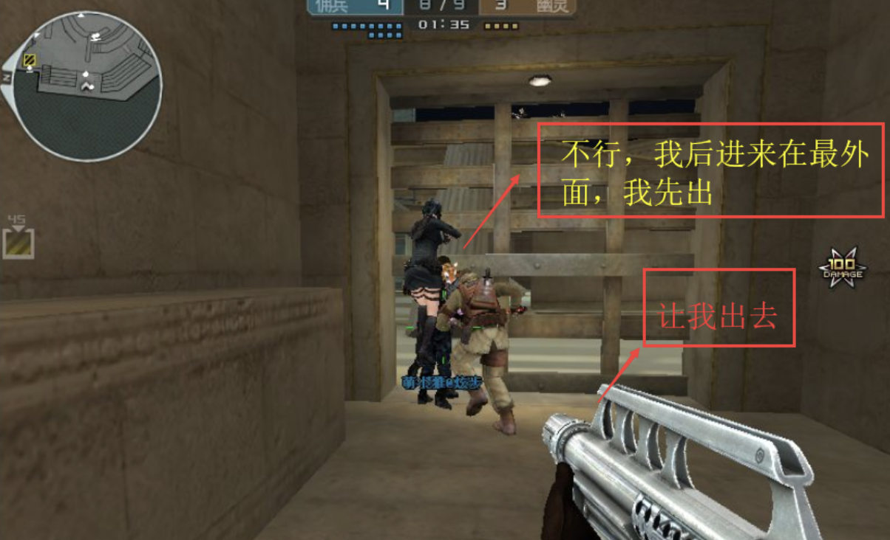
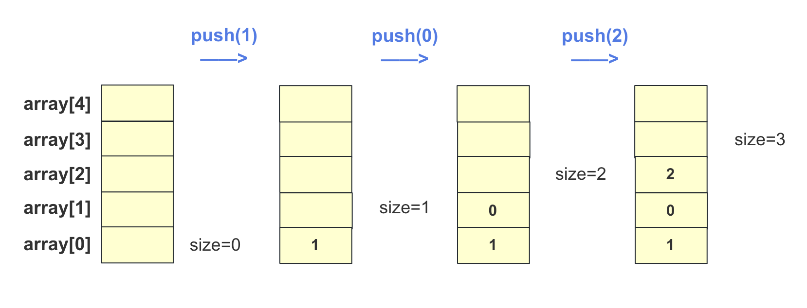
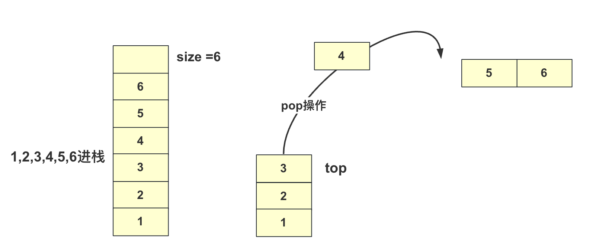
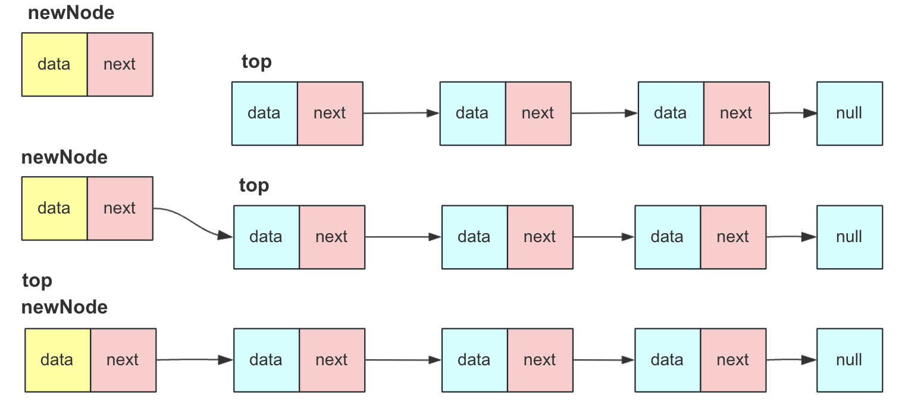
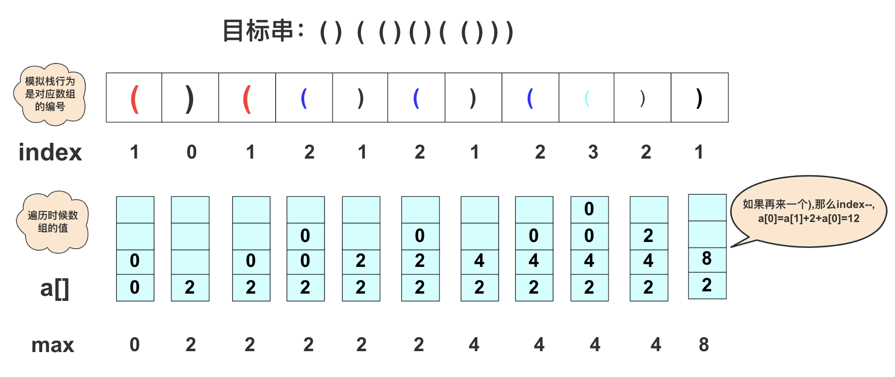

### 什么是栈

栈在我们日常编码中遇到的非常多，很多人对栈的接触可能仅仅局限在 递归使用的栈 和 StackOverflowException，栈是一种后进先出的数据结构(可以想象生化金字塔的牢房和生化角斗场的狗洞)。



栈（stack）是一种运算受限的线性数据结构，它具有以下特点：

**1. 运算受限：** 栈限定仅在表尾进行插入和删除操作，这一端被称为栈顶，而另一端称为栈底。这限制了对栈的操作，只能按照后进先出（LIFO，Last-In-First-Out）的原则进行插入和删除操作。插入操作又称为进栈、入栈或压栈，它将新元素放到栈顶，使之成为新的栈顶元素；删除操作又称为出栈或退栈，它将栈顶元素删除，使其相邻的元素成为新的栈顶元素。

**2. 线性表：** 栈也是一种线性表，它表示数据元素之间的逻辑关系是线性的。虽然具体实现可以使用数组或链表等不同的物理存储结构，但逻辑上各个元素之间是相邻的，操作也是按照顺序进行的。

**3. 栈顶和栈底：** 栈的逻辑结构中有栈顶和栈底的概念。栈顶表示可以进行插入和删除操作的一端，通常与数组的末尾或链表的头部有关。栈底则是相对的另一端，用于限制操作的另一端。

**4. 栈的应用：** 栈在计算机科学和编程中有广泛的应用，例如程序执行调用堆栈、四则运算表达式求值、非递归算法实现、括号匹配问题、浏览器历史、内存分配、任务管理等的解决。掌握栈是非常重要的，它是必须了解的数据结构之一。

栈可以使用数组或链表来实现，选择合适的实现方式取决于具体的应用场景和性能需求。数组实现的栈通常更适合于需要固定大小的栈(当然也可以进行扩容)，而链表实现的栈可以动态扩展，适用于不确定大小的栈。在栈的操作中，栈顶元素是非常关键的，因为它在插入和删除操作中起着重要作用。

总之，栈是一个非常有用的数据结构，它在计算机科学中扮演着重要的角色，了解它的特性和应用对于编程和算法设计至关重要。

对于一个栈的接口，我们简易定义如下：

```java
public interface Stack<T> {
    void push(T item);      // 压栈
    T pop();               // 弹栈
    T peek();              // 获取栈顶元素
    boolean isEmpty();     // 判断栈是否为空
    int size();            // 返回栈的大小
}
```


### 数组实现

数组实现的栈用的比较多，我们经常刷题也会用数组去实现一个简单的栈去解决简单的问题。

**结构设计**

对于数组来说，我们模拟栈的过程很简单，因为栈是后进先出，我们很容易在数组的末尾进行插入和删除。所以我们选定末尾为栈顶。所以对于一个栈所需要的基础元素是 一个**array[]数组**和一个**size**表示大小，还需要一个负载因子表示数组的大小。

**push入栈操作**

- 如果数组满了，需要扩容
- size位置赋值，` array[size++] = data;`



**pop弹出栈并返回首位**

- 如果栈不为空，可以弹出。`return array[--size];`

如下图，当栈中还剩1,2,3,4执行pop操作，栈顶变为3的位置并且返回4



**peek返回栈顶**

- peek操作时返回栈顶不弹出，所以栈不为空时候`return data[size-1]`即可。

**数组实现：**

```java
import java.util.EmptyStackException;

public class SeqStack<T> implements Stack<T> {

    private T array[];
    private int size;
    private static final int DEFAULT_CAPACITY = 10;

    public SeqStack() {
        this.size = 0;
        array = (T[]) new Object[DEFAULT_CAPACITY];
    }

    @Override
    public void push(T data) {
        if (size == array.length) {
            // 如果数组已满，扩展数组
            resizeArray();
        }
        array[size++] = data;
    }

    @Override
    public T pop() {
        if (isEmpty()) {
            throw new EmptyStackException();
        }
        // 下面可以写成 return array[--size];
        T data = array[size - 1];
        size--;
        return data;
    }

    @Override
    public T peek() {
        if (isEmpty()) {
            throw new EmptyStackException();
        }
        return array[size - 1];
    }

    @Override
    public boolean isEmpty() {
        return size == 0;
    }

    @Override
    public int size() {
        return size;
    }

    private void resizeArray() {
        int newCapacity = (int) (array.length * 2);
        T[] newArray = (T[]) new Object[newCapacity];
        for (int i = 0; i < size; i++) {
            newArray[i] = array[i];
        }
        array = newArray;
    }
}
```


### 链表实现

栈可以使用数组或链表来实现，两种思路如下：

1. **链表尾部作为栈顶：** 在数组实现中，栈的操作是在尾部进行插入和删除。链表中即使使用尾指针可以提高尾部插入效率，但删除操作仍然需要查找前驱节点。要实现高效的删除操作，需要使用双向链表，这增加了整个结构的复杂性。
2. **链表头部作为栈顶：** 在这种实现中，栈的设计不带头节点的单链表(不需要哑结点)，所有操作都在链表的头部进行。头部插入删除都很方便效率比较高，编写代码也很简单。

**基础结构**

```java
public class LinkedStack<T> implements Stack<T> {
    private Node<T> top;
    private int size;

    public LinkedStack() {
        top = null;
        size = 0;
    }

    private static class Node<T> {
        T data;
        Node<T> next;
        public Node(T data) {
            this.data = data;
            this.next = null;
        }
    }
  //其他方法
}
```
**push入栈**

与不带头结点单链表头插入一致

- 创建新节点
- 新节点的next指向栈顶节点top
- 栈顶节点top指向新节点，表示这个节点为新的栈顶节点
- size++

部分操作流程如下图  



**pop弹出**

与不带头结点单链表头插入一致

- 判断是否为空
- 记录头结点top的值data
- 头结点top指向top.next
- size--，返回前面记录的值data

部分操作流程如下图  


**peek返回栈顶**

不为空的时候返回 `top.data`即可

链表实现：

```java
import java.util.EmptyStackException;

public class LinkedStack<T> implements Stack<T> {
    private Node<T> top;
    private int size;

    public LinkedStack() {
        top = null;
        size = 0;
    }

    private static class Node<T> {
        T data;
        Node<T> next;

        public Node(T data) {
            this.data = data;
            this.next = null;
        }
    }

    @Override
    public void push(T item) {
        Node<T> newNode = new Node<>(item);
        newNode.next = top;
        top = newNode;
        size++;
    }

    @Override
    public T pop() {
        if (isEmpty()) {
            throw new EmptyStackException();
        }
        T data = top.data;
        top = top.next;
        size--;
        return data;
    }

    @Override
    public T peek() {
        if (isEmpty()) {
            throw new EmptyStackException();
        }
        return top.data;
    }

    @Override
    public boolean isEmpty() {
        return size == 0;
    }

    @Override
    public int size() {
        return size;
    }
}
```


### 栈能这么玩

既然上面详细讲解设计栈，这里来两道栈非常经典非常经典的例题(非常高频，很容易忘，又很重要，普通问题就不放的)


力扣20有效的括号：

题意：给定一个只包括 `'('，')'，'{'，'}'，'['，']'` 的字符串，判断字符串是否有效。

有效字符串需满足：

>左括号必须用相同类型的右括号闭合。
>左括号必须以正确的顺序闭合。
>注意空字符串可被认为是有效字符串。

示例 :
>输入: `"()[]{}"`
>输出: true

示例 :
>输入: `"([)]"`
>输出: false


**分析：**
括号类的问题是经典栈类问题，肯定要想到用栈处理。判断一个字符串满不满足一个有效的字符串，就要看它是不是都能组成对。

从单个括号对来说，`((`,`))`都是不满足的，只有`()`才可满足，即一左一右。

从多个括号对来说 `{[(`字符串还可接受任意无限`(`，`[`,`{`的括号。但是如果向左的括号只能先接收`)`括号(变成`{[`)。

 从上面可以看作一种相消除的思想。例如`(({[()()]}))`字符串遍历时候可以这样处理：
 - `(({[(`下一个`)`消掉成`(({[`
 - `(({[(`下一个`)`消掉成`(({[`
 - `(({[`下一个`]`消掉成`(({`
 - `(({`下一个`}`消掉成`((`
 - `((`下一个`)`消掉成`(`
 - `(`下一个`)`消掉成` ` 这样就满足题意

每次操作的时候都判断剩余有效括号最顶部那个括号是否能够和遍历的相消除，**这个过程利用栈判断当前是加入栈还是消除顶部**，到最后如果栈为空说明满足，否则不满足，当然具体括号要对应，具体实现代码为：

```java
public boolean isValid(String s) {
    Stack<Character> stack = new LinkedStack<Character>();
    for (int i = 0; i < s.length(); i++) {
        char te = s.charAt(i);
        if (te == ']') {
            if (!stack.isEmpty() && stack.pop() == '[')
                continue;
            else {
                return false;
            }
        } else if (te == '}') {
            if (!stack.isEmpty() && stack.pop() == '{')
                continue;
            else {
                return false;
            }
        } else if (te == ')') {
            if (!stack.isEmpty() && stack.pop() == '(') {
                continue;
            } else {
                return false;
            }
        } else {
            stack.push(te);
        }
    }
    return stack.isEmpty();
}
```

当然，JDK自带的栈用起来不快，可以用数组优化：

```java
public boolean isValid(String s) {
    char a[] = new char[s.length()];
    int index = -1;
    for (int i = 0; i < s.length(); i++) {
        char te = s.charAt(i);
        if (te == ']') {
            if (index >= 0 && a[index] == '[')
                index--;
            else {
                return false;
            }
        } else if (te == '}') {
            if (index >= 0 && a[index] == '{')
                index--;
            else {
                return false;
            }
        } else if (te == ')') {
            if (index >= 0 && a[index] == '(')
                index--;
            else {
                return false;
            }
        } else {
            a[++index] = te;
        }
    }
    return index == -1;
}
```


**力扣32最长有效括号(困难)**

题目描述：给定一个只包含 '(' 和 ')' 的字符串，找出最长的包含有效括号的子串的长度。

示例 :

>输入: "(()"
>输出: 2
>解释: 最长有效括号子串为 "()"

示例 :
>输入: ")()())"
>输出: 4
>解释: 最长有效括号子串为 "()()"

**方案一暴力**

这种题核心思想就是使用**栈模拟**。本题的话更简单一点因为只有`(`和`)`两种括号，使用暴力的时候就可以循环每次找到最长的有效括号。而括号匹配的时候可以**直接终止**的情况是`)`右括号多出无法匹配。

例如`())(`到第三个不可能和前面相连。如果来`(`只需要期待后面能够来`)`，一个`)`可以和一个`(`组成一对，消除栈中的一个`(`。

当然，在具体的实现上，我们用数组模拟栈，实现代码为：

```java
public int longestValidParentheses(String s) {
    char str[] = s.toCharArray();//字符数组
    int max = 0;
    for (int i = 0; i < str.length - 1; i++) {
        int index = -1;
        if (max >= str.length - i)
            break;
        for (int j = i; j < str.length; j++) {
            if (str[j] == '(') {
                index++;
            } else {
                if (index < 0) {
                    i = j;
                    break;
                } else {
                    index--;
                }
            }
            if (index == -1 && (j - i + 1 > max)) {
                max = j - i + 1;
            }
        }
    }
    return max;
}
```

这个复杂度太高，我们看看如何用栈优化。

**方案二栈优化**

**如何将这道题从一个O(n^2)的时间复杂度优化到O(n)**？这其实非常简单，只需要注意处理的过程。让我们首先考虑一些可能的最大情况。

- `( )  ) `          `( ) ( (  ) ( ) )` 最大为后面部分(空格分开)
- `( ) ( ) `      `( ( ( )` 最大为前面部分
- `( ( ( ( ( `     `( ) ( ) ( ) ( )` 最大为后面部分

在处理这道题时，我们会注意到不同类型的括号可能会有一些区别：
`(`：左括号一旦出现那么他就期待一个`)`进行匹配，但它的后面可能有`)`并且在这中间有很多其他括号对。
`)`:右扩号有两种情况：

- 一种是当前已经超过左括号前面已经不可能连续了。例如`( ) ) ( )`第三个括号出现已经使得整个串串不可能连续，**最大要么在其左面**，**要么再其右面**。 你可以理解其为一种清零初始机制。
- 另一种情况`)`就是目标栈中存在`(`可与其进行匹配。**匹配之后要叠加到消除后平级的数量上**，并且判断是否是最大值。(下面会解释)

在**具体实现**的思路上，就是使用一个int数组标记当前层级(栈深)有正确的括号数量。	模拟一次栈行为从左向右，遇到`)`太多(当前栈中不存在`(`进行匹配)就将数据清零重新开始。这样一直到最后。你可以把它看成台接，遇到`(`就上一个台阶**并清零该新台阶**，遇到`)`就下一个台阶并且把**数量加到下降后的台阶上**。具体可以看下面图片模拟的过程：
`( )  (  ( ) ( ) (  ( ) ) )`



具体实现代码为：

```java
public static int longestValidParentheses(String s) {
    int max = 0;
    int value[] = new int[s.length() + 1];
    int index = 0;
    for (int i = 0; i < s.length(); i++) {
        if (s.charAt(i) == '(') {
            index++;
            value[index] = 0;
        } else {//")"
            if (index == 0) {
                value[0] = 0;
            } else {
                value[index - 1] += value[index--] + 2;//叠加
                if (value[index] > max)//更新
                    max = value[index];
            }
        }
    }
    return max;
}
```

用栈也可以实现，但是效率比数组略低：

```java
public int longestValidParentheses(String s) {
  int maxans = 0;
  Stack<Integer> stack = new Stack<>();
  stack.push(-1);
  for (int i = 0; i < s.length(); i++) {
    if (s.charAt(i) == '(') {//(将当前的 
      stack.push(i);
    } else {
      stack.pop();
      if (stack.empty()) {
        stack.push(i);
      } else {//i-stack.peek就是i是出现的总个数 peek是还没匹配的个数
        maxans = Math.max(maxans, i - stack.peek());
      }
    }
  }
  return maxans;
}
```


### 总结

到这里，本文对栈的介绍就结束了，相信你可以手写个栈并且可以小试牛刀解决括号匹配问题！当然栈能解决的问题还有很多比如接雨水问题、二叉树非递归遍历等等，有些重要的还会再总结。

