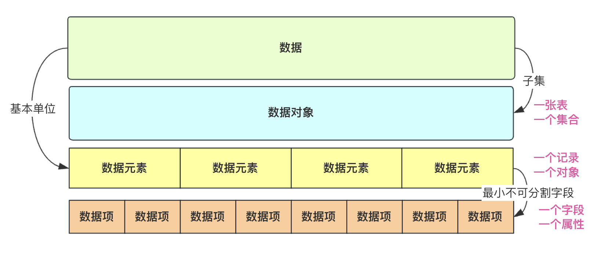
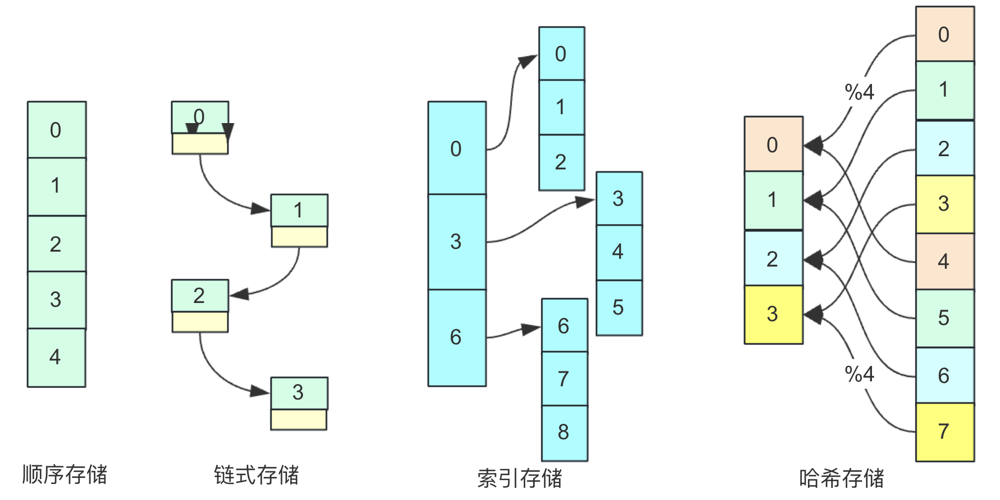
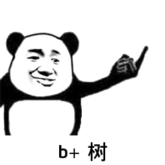

## 前言

数据结构与算法是程序员内功体现的重要标准之一，且数据结构也应用在各个方面，业界更有**程序=数据结构+算法**这个等式存在。各个中间件开发者，架构师他们都在努力的优化中间件、项目结构以及算法提高运行效率和降低内存占用，在这里数据结构起到相当重要的作用。此外数据结构也蕴含一些面向对象的思想，故学好掌握数据结构对逻辑思维处理抽象能力有很大提升。

为什么学习数据结构与算法？如果你还是学生，那么这门课程是必修的，考研基本也是必考科目。工作在内卷严重的大厂中找工作数据结构与算法也是面试、笔试必备的非常重要的考察点。如果工作了数据结构和算法也是内功提升一个非常重要的体现，对于程序员来说，想要得到满意的结果，数据结构与算法是必备功力！

## 数据结构


### 概念

数据结构是计算机存储、组织数据的方式。数据结构是指相互之间存在一种或多种特定关系的数据元素的集合。通常情况下，精心选择的数据结构可以带来更高的运行或者存储效率。

简言之，数据结构是一系列的存储结构按照一定执行规则、配合一定执行算法所形成的高效的存储结构。在我们所熟知的关系数据库、非关系数据库、搜索引擎存储、消息队列等都是比较牛的大型数据结构良好的运用。当然这些应用中间件不单单要考虑单纯的结构问题。还考虑实际os、网络等其他因素。

而对于数据结构与算法这个专栏。我们程序员更要掌握的首先是在内存中运行的抽象的数据结构。是一个相对比较单一的数据结构类型，比如线性结构、树、图等等.

### 相关术语

在数据结构与算法中，**数据、数据对象、数据元素、数据项**很多人搞不清其中的关系。通过画一张图来捋一捋，然后下面举个例子给大家分享一下。




**用户信息表users**

| id   | name     | sex   |
| ---- | -------- | ----- |
| 001  | bigsai   | man   |
| 002  | smallsai | man   |
| 003  | 菜虚鲲   | woman |

**Users的pojo对象**

```java
class User
{ 
     //略
     int id;
     String name;
     String sex;
}
//list和woman是数据
List<User>users;//数据对象list
List<User>women;//数据对象women
users.add(new User(001,"bigsai","man"));//添加数据元素 一个user由（001，bigsai，man）三个数据项组成 
users.add(new User(002,"smallsai","man"));//数据元素
users.add(new User(003,"菜虚鲲","woman"));//数据元素
woman.add(users.get(2));//003,"菜虚鲲","woman"三个数据项构成的一个数据元素
```

**数据**：对客观事物的符号表示，指所有能输入到计算机中并被计算机程序处理的符号的集合总称。上述表中的三条用户信息的记录就是数据(也可能多表多集合这里只有一个)。这些数据一般都是用户输入或者是自定义构造完成。当然，还有一些图像、声音也是数据。

**数据元素**：数据元素是**数据的基本单位**。一个数据元素由若干数据项构成！可认为是一个pojo对象、或者是数据库的一条记录。比如菜虚鲲那条记录就是一个数据元素。

**数据项**： 而构成用户字段/属性的有`id`、`name`、`sex`等，这些就是数据项.数据项是构成数据元素的最小不可分割字段。可以看作一个pojo对象或者一张表(people)的一个属性/字段的值。

**数据对象**：是相同性质数据元素的集合。是数据的一个子集，比如上面的`users`表、`list`集合、`woman`集合都是数据对象。单独一张表，一个集合都可以是一个数据对象。

总的捋一捋，数据范围最广，所有数据即数据，而数据对象仅仅是有相同性质的一个集合，这个集合是数据的子集，但并不是数据的基本单位，而数据元素才是数据的基本单位。举个例子表cat和表dog都是数据，然后表cat是个数据对象(因为都描述cat这种对象)，但是数据的基本单位并不是猫和狗，而是他们的具体的每一条记录，比如小猫咪1号，大猫咪二号，哈士奇1号，藏獒2号这些每一条记录才是数据的基本单位。

还有数据类型，抽象数据类型也在下面讲一讲。

**数据类型**

- 原子类型：其值不可再分的类型。比如int，char，double，float等。

- 结构类型：其值可以再分为若干成分的数据类型。比如结构体构造的各种结构等。

**抽象数据类型(ADT)**：抽象数据类型（ADT）是一个实现包括存储数据元素的存储结构以及实现基本操作的算法。使得只研究和使用它的结构而不用考虑它的实现细节成为可能。比如我们使用List、Map、Set等等只需要了解它的API和性质功能即可。而具体的实现可能是不同的方案，比如List的实现有数组和链表不同选择。

### 三要素

**逻辑结构**：数据元素之间的逻辑关系。逻辑结构分为线性结构和非线性结构。线性结构就是顺序表、链表之类。而非线性就是集合、树、图这些结构。

**存储结构**：数据结构在计算机中的表示(又称映像，也称物理结构)，存储结构主要分为**顺序存储**、**链式存储**、**索引存储**和**散列(哈希)存储**，这几种存储通过下面这张图简单了解一下(仅仅为理解不考虑更多)：



**数据的运算**：施加在数据上的运算包括运算的**定义和实现**，运算的定义基于逻辑结构，运算的实现基于存储结构。

在这里容易混淆的是逻辑结构与存储结构的概念。对于**逻辑结构**，不难看得出逻辑二字，逻辑关系也就是两者存在数据上的关系而不考虑物理地址的关系，比如线性结构和非线性结构，它描述的是一组**数据中联系**的方式和形式，他针对的是**数据**。看中的是数据结构的功能，比如线性表就是前后有序的，我需要一个有序的集合就可以使用线性表。

而**存储结构**就是跟物理地址挂钩的。因为同样逻辑结构采用不同存储结构实现适用场景和性能可能不同。比如同样是**线性表**,可能有多种存储结构的实现方式。比如顺序表和链表(Arraylist,Linkedlist)它们的存储结构就不同，一个是顺序存储(数组)实现，一个是链式存储(链表)实现。它关注的是计算机运行物理地址的关系。但通常同一类存储结构实现的一些数据结构有一些类似的共同点和缺点(线性易查难插、链式易插难查等等)。

## 算法分析

上面讲了数据结构相关概念，下面对算法分析的一些概念进行描述。




算法的五个重要特征：**有穷性、确定性、可行性、输入、输出**。这些从字面意思即可理解，其中有穷性强调算法要有结束的时候不能无限循环；而确定性是每条指令有它意义，相同的输入得到相同的输出；可行性是指算法每个步骤经过若干次执行可以实现；输入是0个或多个输入(可0);输出是1个或多个输出(一定要有输出)。

而一个好的算法，通常更要着重考虑的是效率和空间资源占用(时间复杂度和空间复杂度)，通常复杂度更多描述的是一个`量级`程度而很少用具体数字描述。

### 空间复杂度

**概念**：是对一个算法在运行过程中临时占用存储空间大小的量度，记做S(n)=O(f(n))

空间复杂度其实在算法的衡量占比是比较低的(我们经常使用牺牲空间换时间的数据结构和算法)，但是不能忽视空间复杂度中重要性。无论在刷题还是实际项目生产内存都是一个极大额指标。对于Java而言更是如此。本身内存就大，如果采用的存储逻辑不太好会占用更多的系统资源，对服务造成压力。

而算法很多情况都是牺牲空间换取时间(效率)。就比如我们熟知的字符串匹配`String.contains()`方法，我们都知道他是暴力破解，时间复杂度为O(n^2),不需要借助额外内存。而`KMP`算法在效率和速度上都原生暴力方法，但是KMP要借助其他数组(`next[]`)进行标记储存运算。就用到了空间开销。再比如归并排序也会借助新数组在递归分冶的适合进行逐级计算，提高效率，但增加点影响不大的内存开销。

当然，算法的空间花销最大不能超过jvm设置的最大值，一般为2G.(2147483645)如果开二维数组多种多维数据不要开的太大，可能会导致`heap OutOfMemoryError`。 

### 时间复杂度

**概念**：计算机科学中，算法的时间复杂度是一个`函数`，它定性描述了该算法的运行时间。这是一个关于代表算法输入值的字符串的长度的函数。时间复杂度常用大O符号表述，**不包括这个函数的低阶项和首项系数**。使用这种方式时，时间复杂度可被称为是渐近的，它考察当输入值大小趋近无穷时的情况。

**时间复杂度的排序**：O(1) < O(logn) < O(n) < O(nlogn) < O(n^2) < O(n^3) < O(2^n) <O(n!) < O(n^n)

**常见时间复杂度**：对于时间复杂度，很多人的概念是比较模糊的。下面举例子说明一些时间复杂度。

O(1):  常数函数
- `a=15`

O(logn): 对数函数

- `for(int i=1;i<n;i*=2)`
分析：假设执行`t`次使得`i=n`;有2^t=n; t=log2~n,为log级别时间复杂度为O(logn)。
- 还有典型的二分查找，拓展欧几里得，快速幂等算法均为O(logn)。属于高效率算法。

O(n): 线性函数
- `for (int i=0;i<n;i++)`
- 比较常见，能够良好解决大部分问题。

O(nlogn): 
- `for (int i=1;i<n;i++)`
` for (int j=1;j<i;j*=2)`
- 常见的排序算法很多正常情况都是nlogn，比如快排、归并排序。这种算法效率大部分也还不错。

O(n^2)

- `for(int i=0;i<n;i++)`
 `for(int j=0;j<i;j++)`
 - 其实O(n^2)的效率就不敢恭维了。对于大的数据O(n^2)甚至更高次方的执行效果会很差。

当然如果同样是n=10000.那么不同时间复杂度额算法执行次数、时间也不同。


|    具体    |     n | 执行次数      |
| :--------: | ----: | ------------- |
|    O(1)    | 10000 | 1             |
|  O(log2n)  | 10000 | 14            |
| O( n^1/2)  | 10000 | 100           |
|    O(n)    | 10000 | 10000         |
| O(nlog2 n) | 10000 | 140000        |
|   O(n^2)   | 10000 | 100000000     |
|   O(n^3)   | 10000 | 1000000000000 |

降低算法复杂度有些会靠数据结构的特性和优势，比如二叉排序树的查找，线段树的动态排序等等，这些数据结构解决某些问题有些非常良好的性能。还有的是靠算法策略解决，比如同样是排序，冒泡排序这种笨而简单的方法就是O(n2),但快排、归并等聪明方法就能O(nlogn)。要想变得更快，那就得掌握更高级的数据结构和更精巧的算法。

**时间复杂度计算**
时间复杂度计算一般`步骤`：1、找到执行次数最多的语句; 2、计算语句执行的数量级 ; 3、用O表示结果。并且有两个规则：

加法规则： 同一程序下如果多个并列关系的执行语句那么取最大的那个,eg:

``` 
T(n)=O(m)+O(n)=max(O(m),O(n)); 
T(n)=O(n)+O(nlogn)=max(O(n),O(nlogn))=O(nlogn);
```

乘法规则：循环结构，时间复杂度按乘法进行计算,eg：

```
T(n)=O(m)*O(n)=O(mn)
T(n)=O(m)*O(m)=O(m^2)(两层for循环)
```

当然很多算法的时间复杂度还跟输入的数据有关，分为还会有最优时间复杂度(可能执行次数最少时)，最坏时间复杂度(执行次数最少时)，平均时间复杂度，这在排序算法中已经具体分析，但我们通常使用**平均时间复杂度**来衡量一个算法的好坏。


## 数据结构与算法学习

捋过数据结构与算法基本概念的介绍，在学习数据结构与算法方面，个人把经典的数据结构与算法学习过程步骤写在下面，希望能给大家一个参考：

### 数据结构

- 单链表(带头结点、不带头结点)设计与实现(增删改查)，双链表设计与实现

- 栈设计与实现(数组和链表)，队列设计与实现(数组和链表)

- 二叉树概念学习，二叉树前序、中序、后序遍历递归、非递归实现 ，层序遍历

- 二叉排序树设计与实现(插入删除)
- 堆(优先队列、堆排序)

- AVL(平衡)树设计与实现(四种自旋方式理解实现)

- 伸展树、红黑树原理概念理解

- B、B+原理概念理解

- 哈夫曼树原理概念理解(贪心策略)

- 哈希(散列表)原理概念理解(几种解决哈希冲突方式)
- 并查集/不相交集合(优化和路径压缩)
- 图论拓扑排序
- 图论dfs深度优先遍历、bfs广度优先遍历
- 最短路径Dijkstra算法、Floyd算法、spfa算法
- 最小生成树prim算法、kruskal算法
- 其他数据结构线段树、后缀数组等等

### 经典算法

- 递归算法(求阶乘、斐波那契、汉诺塔问题)
- 二分查找
- 分治算法(快排、归并排序、求最近点对等问题)
- 贪心算法(使用较多，区间选点问题，区间覆盖问题)
- 常见动态规划(LCS(最长公共子序列) LIS(最长上升子序列)背包问题等等)
- 回溯算法(经典八皇后问题、全排列问题)
- 位运算常见问题(参考剑指offer和LeetCode问题)
- 快速幂算法(快速求幂乘、矩阵快速幂)
- kmp等字符串匹配算法
- 一切其他数论算法(欧几里得、拓展欧几里得、中国剩余定理等等)

相信看完这篇文章，你应该对数据结构与算法有个不错的认知。数据结构与算法有着非常密切的关联，数据结构是为了实现某种算法，算法是核心目的。学习数据结构与算法之前，可以先参考书本或者博客先了解其功能，再研究其运行原理，再动手实战(编写数据结构或者相关题目)这样层次渐进，想要深入的学习数据结构与算法光理解是不行的，需要有大量代码实战才可。并且这条路是没有止境的，活到老，学到老，刷到老。

