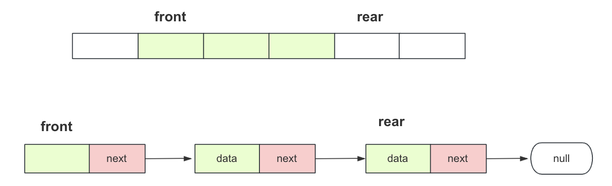
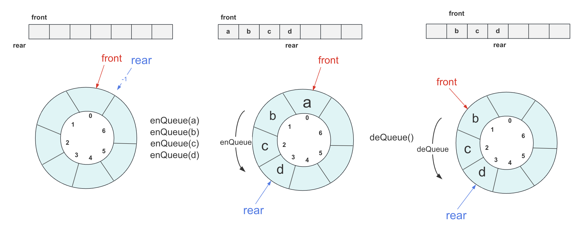
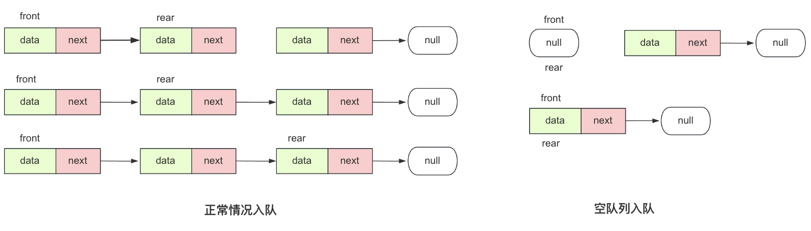
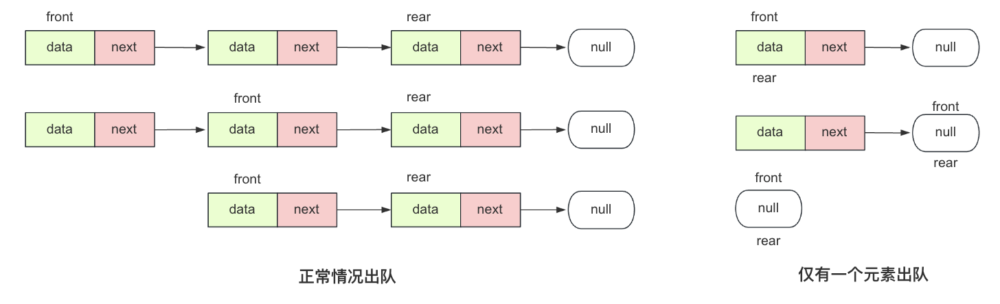

### 前言

栈和队列是一对紧密相关的数据结构。之前已经介绍过栈（它遵循后进先出的原则），栈的机制相对简单，就像你进入一个狭窄的山洞，山洞只有一个出入口，因此你只能按照后进先出的顺序离开。这意味着最后进入山洞的人会最先离开，而先进入的人需要等待。这就是栈的工作原理。

而队列就好比是一个隧道，人们按照先来后到的顺序排队前进，而最早排队的人会首先通过隧道。队列的运作方式被称为先入先出，即先进入队列的元素将会先离开。

**栈是一种喜新厌旧的数据结构**，新数据到来时，会处理新数据，而老数据将被推迟处理。因此栈的一些使用场景可能会遇到一些饥饿的情况。

**队列则是一种公平的数据结构**，它按照先后顺序处理数据，非常注重顺序性。因此，队列在程序设计、中间件等领域都得到了广泛应用，例如消息队列、FIFO磁盘调度、二叉树的层序遍历、BFS搜索等等。

队列的核心理念可以用简单的一句话来表达：**先进先出**！

队列是一种特殊的线性表，其特殊之处在于只允许在表的前端（队头）进行删除操作，而在表的后端（队尾）进行插入操作。和栈一样，队列也是一种操作受限制的线性表。在队列中，进行插入操作的一端称为队尾，而进行删除操作的一端称为队头。

在学习队列前，最好先了解顺序表的基本操作和栈的数据结构。这样可以更好地理解队列的概念和工作原理，并提高学习效果。


### 队列介绍

我们设计队列时候可以选择一个标准:

**队头front：** 删除数据的一端。

**队尾rear：** 插入数据的一端。

**对于数组**，从数组后面插入更容易，数组前面插入较困难，所以一般用数组实现的队列队头在数组前面，队尾在数组后面；而对于**链表**，插入删除在两头分别进行那么头部(前面)删除尾部插入最方便的选择。



实现一个队列的接口：

```
public interface Queue<T> {
    // 向队列尾部插入元素，如果成功插入则返回 true，否则返回 false
    boolean enQueue(T item);

    // 从队列头部删除一个元素，如果成功删除则返回 true，否则返回 false
    boolean deQueue();

    // 返回队列头部的元素，如果队列为空，返回 null
    T peek();

    // 检查队列是否为空
    boolean isEmpty();

    // 返回队列的大小
    int size();
}
```


### 循环队列(数组实现)

> 普通队列并不能满足使用需求，因为用数组实现的普通队列不论是入队还是出队都往一个方向操作，这样会导致很快到达数组的末尾。

为了解决普通队列资源利用率很低的问题，可以使用数组实现一个循环队列提高数组的利用率，具体的实现方式是对每个位置操作时候对实际地址取余这样尾和首就实现了逻辑上的连续。

 实现循环队列，大致知道其原理，就要针对一些细节进行推敲以及定义，避免模糊。

front：表示队头，头位置元素出，定义`array[front]`为队列第一个元素位置。

rear：表示队尾，尾位置用来插入，定义`array[tail]`为队列最后一个元素位置。



**初始化**：刚开始由于是空的，front为0，rear为-1，不过怎么样定义front和rear并不位于，需要处理好**入队、出队、判空、判满**的逻辑即可。

**入队enQueue**：队不满，先队尾逻辑上后移一位`rear=(rear + 1) % arrLength;`然后赋值，size++

**出队deQueue**：队不空，队头逻辑上后移一位，`front=(front + 1)% arrLength;`然后size--

这里出队入队指标相加如果遇到最后需要转到头位置，这里直接+1求余找到位置(相比判断是否在最后更加简洁)，其中**arrLength**是数组实际大小。

**取队头peek**：队不空，返回`array[front]`

**是否为空**：size是否为0


具体实现：

```java
public class ArrayQueue<T> implements Queue<T> {
    private T[] array;
    private int front; // 指向队列头部
    private int rear; // 指向队列尾部
    private int size;

    public ArrayQueue(int capacity) {
        array = (T[]) new Object[capacity];
        front = 0;
        rear = -1;
        size = 0;
    }

    @Override
    public boolean enQueue(T item) {
        if (size == array.length) {
            // 队列已满
            return false;
        }
        rear = (rear + 1) % array.length; // 循环队列，计算新的尾部位置
        array[rear] = item;
        size++;
        return true;
    }

    @Override
    public boolean deQueue() {
        if (isEmpty()) {
            // 队列为空
            return false;
        }
        front = (front + 1) % array.length; // 循环队列，移动头部指针
        size--;
        return true;
    }

    @Override
    public T peek() {
        if (isEmpty()) {
            return null;
        }
        return array[front];
    }

    @Override
    public boolean isEmpty() {
        return size == 0;
    }

    @Override
    public int size() {
        return size;
    }
}
```


### 循环队列(链表实现)


我们知道队列是先进先出的，对于链表，我们能采用单链表尽量采用单链表，能方便尽量方便，同时还要兼顾效率。使用链表大概有两个实现方案：

**方案一** 如果队列头设在链表尾，队列尾设在链表头。那么**队尾进队插入**在链表头部插入没问题，容易实现，但是如果**队头删除**在链表尾部进行，如果不设置尾指针要遍历到队尾，但是设置尾指针删除需要将它前驱节点**需要双向链表**，都挺麻烦的。

**方案二**如果队列头设在链表头，队列尾设在链表尾，那么**队尾进队插入**在链表尾部插入没问题(用尾指针可以直接指向next)，容易实现，如果**队头删除**在链表头部进行也很容易，就是我们前面常说的**头节点删除节点**。

所以我们最终采取的是方案二，其中链表的头部表示队头，链表的尾部表示队尾。入队操作在队尾插入元素，出队操作在队头删除元素，通过维护 `head` 和 `tail` 指针来管理队列。希望这个示例满足你的需求。

**主要操作为：**

**初始化**：head和tail均为null，size为0；

**入队**：

- 创建新节点

- 如果队列为空(tail为null)，head和tail都指向新节点
- 如果队列不为空，tail的next指向新节点，tail指向新节点
- size++



**出队**：

- 如果不为空，移除链表头节点
- head指向head后面(head.next)表示删除
- size--
- 如果head为null，tail也设为null(此时表示队列已经空了)



实现代码：

```java
public class LinkedQueue<T> implements Queue<T> {
    private Node<T> head; // 队列头部
    private Node<T> tail; // 队列尾部
    private int size;

    public LinkedQueue() {
        head = null;
        tail = null;
        size = 0;
    }

    @Override
    public boolean enQueue(T item) {
        Node<T> newNode = new Node<>(item);
        if (isEmpty()) {
            head = newNode;
            tail = newNode;
        } else {
            tail.next = newNode; // 将新元素添加到队列尾部
            tail = newNode; // 更新队列尾部指针 也可携程tail=tail.next
        }
        size++;
        return true;
    }

    @Override
    public boolean deQueue() {
        if (isEmpty()) {
            return false;
        }
        head = head.next; // 移除队列头部的元素
        size--;
        if (head == null) {
            // 如果队列为空，将尾部也设置为null
            tail = null;
        }
        return true;
    }

    @Override
    public T peek() {
        if (isEmpty()) {
            return null;
        }
        return head.data; // 返回队列头部的元素数据
    }

    @Override
    public boolean isEmpty() {
        return size == 0;
    }

    @Override
    public int size() {
        return size;
    }

    private static class Node<T> {
        T data;
        Node<T> next;

        Node(T data) {
            this.data = data;
            this.next = null;
        }
    }
}
```


### 双向队列(加餐)

设计实现双端队列，其实你经常使用的ArrayDeque就是一个经典的双向队列，其基于数组实现，效率非常高。我们这里实现的双向队列模板基于[力扣641 设计循环双端队列 ](https://leetcode-cn.com/problems/design-circular-deque/) 。
你的实现需要支持以下操作：

- MyCircularDeque(k)：构造函数,双端队列的大小为k。
- insertFront()：将一个元素添加到双端队列头部。 如果操作成功返回 true。
- insertLast()：将一个元素添加到双端队列尾部。如果操作成功返回 true。
- deleteFront()：从双端队列头部删除一个元素。 如果操作成功返回 true。
- deleteLast()：从双端队列尾部删除一个元素。如果操作成功返回 true。
- getFront()：从双端队列头部获得一个元素。如果双端队列为空，返回 -1。
- getRear()：获得双端队列的最后一个元素。 如果双端队列为空，返回 -1。
- isEmpty()：检查双端队列是否为空。
- isFull()：检查双端队列是否满了。

其实有了上面的基础，实现一个双端队列非常容易，有很多操作和单端的循环队列是一致的，只有多了一个**队头插入**和**队尾删除**的操作，两个操作分别简单的分析一下：

**队头插入**：队友front下标位置本身是有值的，所以要将front退后一位然后再赋值，不过要考虑是否为满或者数组越界情况。

**队尾删除**：只需要rear位置减1，同时也要考虑是否为空和越界情况。


具体实现代码：

```java
public class MyCircularDeque {
    private int data[];// 数组容器
    private int front;// 头
    private int rear;// 尾
    private int maxsize;// 最大长度

    /*初始化 最大大小为k */
    public MyCircularDeque(int k) {
        data = new int[k + 1];
        front = 0;
        rear = 0;
        maxsize = k + 1;
    }

    /**
     * 头部插入
     */
    public boolean insertFront(int value) {
        if (isFull()) {
            return false;
        } else {
            front = (front + maxsize - 1) % maxsize;
            data[front] = value;
        }
        return true;
    }

    /**
     * 尾部插入
     */
    public boolean insertLast(int value) {
        if (isFull()) {
            return false;
        } else {
            data[rear] = value;
            rear = (rear + 1) % maxsize;
        }
        return true;
    }

    /**
     * 正常头部删除
     */
    public boolean deleteFront() {
        if (isEmpty()) {
            return false;
        } else {
            front = (front + 1) % maxsize;
        }
        return true;
    }

    /**
     * 尾部删除
     */
    public boolean deleteLast() {
        if (isEmpty()) {
            return false;
        } else {
            rear = (rear + maxsize - 1) % maxsize;
        }
        return true;
    }

    /**
     * Get the front item
     */
    public int getFront() {
        if (isEmpty()) {
            return -1;
        }
        return data[front];
    }

    /**
     * Get the last item from the deque.
     */
    public int getRear() {
        if (isEmpty()) {
            return -1;
        }
        return data[(rear - 1 + maxsize) % maxsize];
    }

    /**
     * Checks whether the circular deque is empty or not.
     */
    public boolean isEmpty() {
        return front == rear;
    }

    /**
     * Checks whether the circular deque is full or not.
     */
    public boolean isFull() {
        return (rear + 1) % maxsize == front;
    }
}
```


### 总结

队列相比栈数据结构复杂一些，要记住先进先出的规则，然后用数组或者链表实现即可。

数组实现循环队列，主要是要注意循环取余的妙用，链表实现队列需要考虑为空状态。

而双向队列则是既能当队列又能当栈的一种高效数据结构，掌握还是很有必要的。

