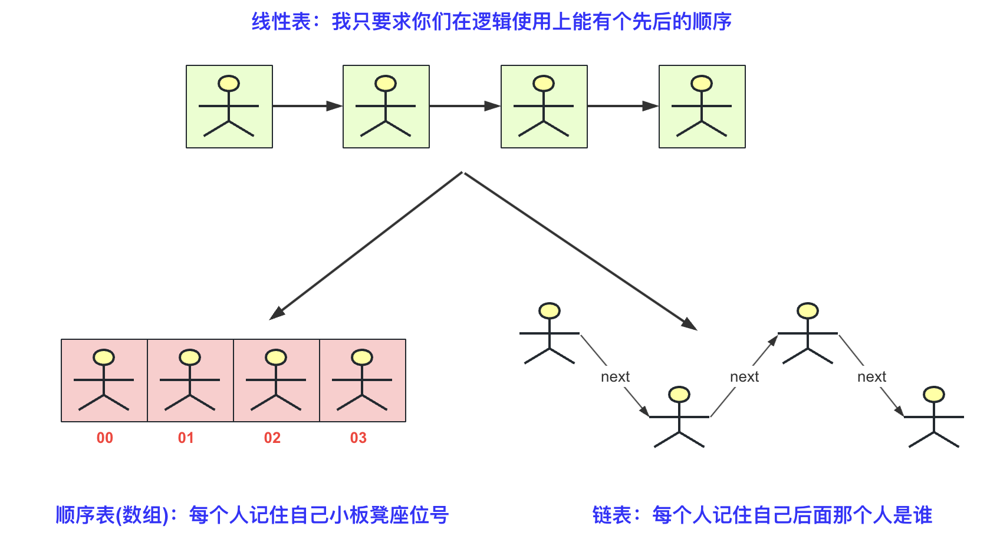
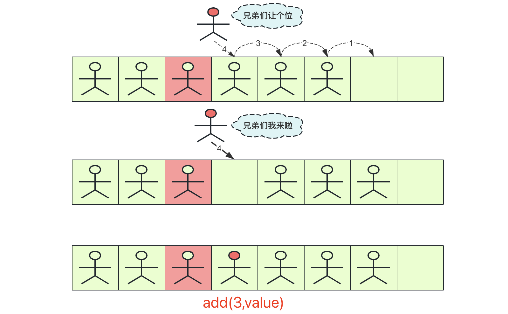
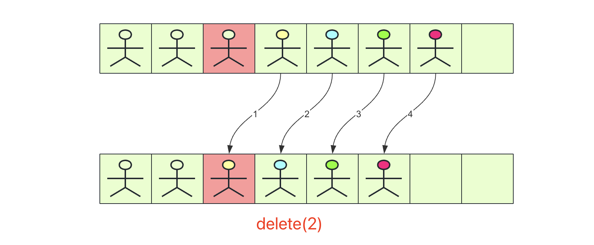
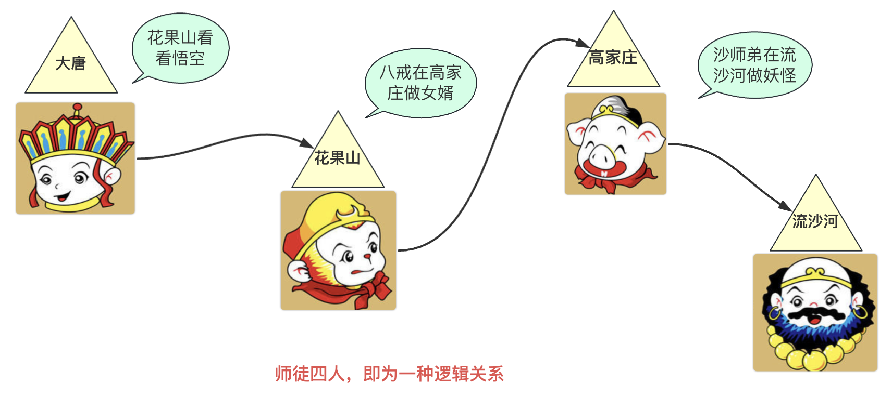
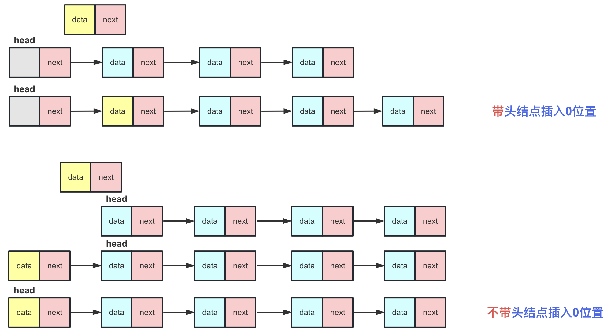
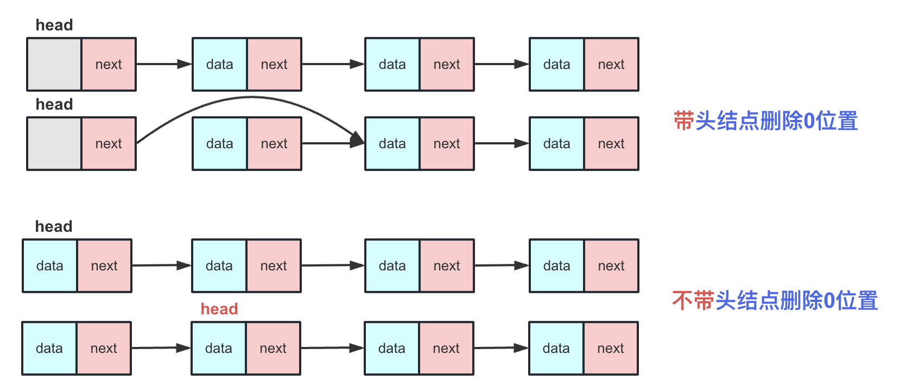
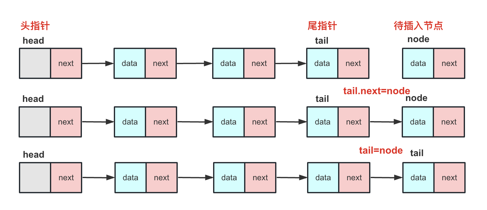
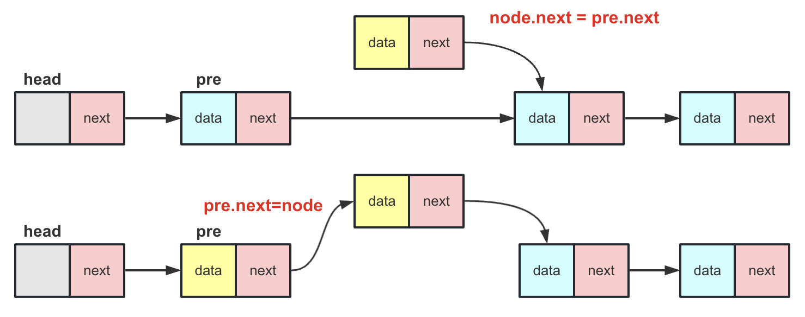
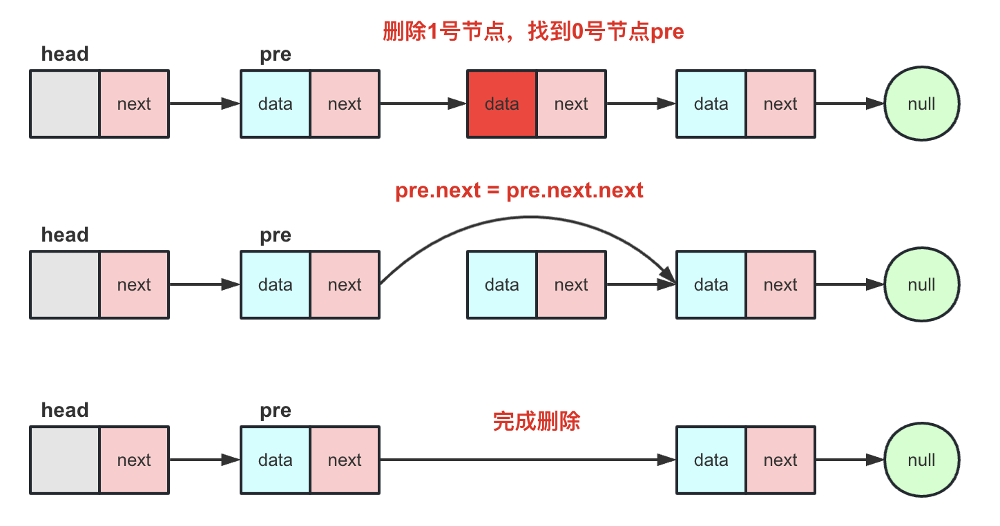

## 前言
通过前面数据结构与算法基础知识我们知道了数据结构的一些概念和重要性，那么本章总结下线性表相关的内容。当然，我用自己的理解分享给大家。

其实说实话，可能很多人依然分不清**线性表**，**顺序表**，和**链表**之间的区别和联系！
- 线性表：**逻辑结构**， 就是对外暴露数据之间的关系，不关心底层如何实现，数据结构的逻辑结构大分类就是线性结构和非线性结构而顺序表、链表都是一种线性表。
- 顺序表、链表：**物理结构**，他是实现一个结构实际物理内存上的结构。比如顺序表就是用**数组**实现。而链表主要用**指针**完成工作。不同的结构在不同的场景有不同的区别。

在Java中，大家都知道`List`接口，这就是逻辑结构，它封装了一个线性关系的一系列方法，用于表示和维护线性关系。而具体的实现其实就是跟物理结构相关的内容。比如顺序表的内容存储使用数组的，然后一个get，set，add方法都要**基于数组**来完成,而链表是**基于指针**的，基于不同的物理结构要根据结构的特性维护数据的存储和线性关系。

下面用一个图来浅析物理结构中顺利表和链表之间的区别。



## 线性表基本架构

对于一个线性表来说，不管它的具体实现如何，它们的方法函数名和实现效果应该一致（即使用方法相同、达成逻辑上的效果相同，差别的是实现方式可能针对不同的场景效率不同）。线性表的概念与Java的接口/抽象类有一些相似之处。最著名的例子就是List接口的ArrayList和LinkedList，List是一种逻辑上的结构，表示这种结构为线性表，而ArrayList和LinkedList更多的是一种物理结构（数组和链表）。

所以基于面向对象的编程思维，我们可以将线性表写成一个接口，而具体实现的顺序表和链表的类可以实现这个线性表的方法，以提高程序的可读性。还有一点非常重要，初学数据结构与算法时实现的线性表都是固定类型（例如int），随着知识的进步，我们应当采用泛型来实现更合理的方式。至于接口的具体设计如下：

```java
public interface ListInterface<T> {
    void init(int initialSize); // 初始化表
    int length();
    boolean isEmpty(); // 是否为空
    int elemIndex(T t); // 找到编号
    T getElem(int index); // 根据index获取数据
    void add(int index, T t) ; // 根据index插入数据
    void delete(int index) ;
    void add(T t) ; // 尾部插入
    void set(int index, T t) ;
    String toString(); // 转成String输出
}
```

## 顺序表
顺序表是基于数组实现的，所有实现需要基于数组特性。对于顺序表的结构应该有一个存储数据的数组**data**和有效使用长度**size**.

这里为了简单就不实现扩容、异常处理相关的操作。

下面着重讲解一些初学者容易混淆的概念和方法实现。这里把顺序表比作**一队坐在板凳上的人。**

### 插入操作
**add(int index,T value)** 

其中index为插入的编号位置，value为插入的数据，插入的流程为：

(1)从后(最后一个有数据位)向前到index依次后移一位，腾出index位置的空间

(2)将待插入数据赋值到index位置上，完成插入操作



顺序表很长，在靠前的地方如果插入效率比较低(插入时间复杂度为O(n))，如果频繁的插入那么复杂度挺高的。

### 删除操作

同理，删除原理和插入类似，删除index位置的操作就是从index开始(index+1)数据赋值到index位置，一直到size-1位置，具体可以看这张图：



### 代码实现

这里实现一个简单的顺序表：

```java
public class SeqList<T> implements ListInterface<T> {
    private T[] array;
    private int size;

    public SeqList() {
        // 默认构造函数
         init(10);
    }

    @Override
    public void init(int initialSize) {
        array = (T[]) new Object[initialSize];
        size = 0;
    }

    @Override
    public int length() {
        return size;
    }

    @Override
    public boolean isEmpty() {
        return size == 0;
    }

    @Override
    public int elemIndex(T value) {
        for (int i = 0; i < size; i++) {
            if (array[i].equals(value)) {
                return i;
            }
        }
        return -1;
    }

    @Override
    public T getElem(int index) {
        if (index < 0 || index >= size) {
            throw new IndexOutOfBoundsException("Index is out of bounds.");
        }
        return array[index];
    }

    @Override
    public void add(int index, T value) {
        if (index < 0 || index > size) {
            throw new IndexOutOfBoundsException("Index is out of bounds.");
        }
        if (size == array.length) {
            // 如果数组已满，扩展数组
            resizeArray();
        }
        // 将index之后的元素后移一位
        for (int i = size; i > index; i--) {
            array[i] = array[i - 1];
        }
        array[index] = value;
        size++;
    }

    @Override
    public void delete(int index) {
        if (index < 0 || index >= size) {
            throw new IndexOutOfBoundsException("Index is out of bounds.");
        }
        // 将index之后的元素前移一位
        for (int i = index; i < size - 1; i++) {
            array[i] = array[i + 1];
        }
        size--;
    }

    @Override
    public void add(T value) {
        if (size == array.length) {
            // 如果数组已满，扩展数组
            resizeArray();
        }
        array[size] = value;
        size++;
    }

    @Override
    public void set(int index, T value) {
        if (index < 0 || index >= size) {
            throw new IndexOutOfBoundsException("Index is out of bounds.");
        }
        array[index] = value;
    }

    @Override
    public String toString() {
        StringBuilder sb = new StringBuilder("[");
        for (int i = 0; i < size; i++) {
            sb.append(array[i]);
            if (i < size - 1) {
                sb.append(", ");
            }
        }
        sb.append("]");
        return sb.toString();
    }

    private void resizeArray() {
        int newCapacity = (int) (array.length * 1.5);
        T[] newArray = (T[]) new Object[newCapacity];
        for (int i = 0; i < size; i++) {
            newArray[i] = array[i];
        }
        array = newArray;
    }
}
```


## 链表
在学习C/C++时，链表往往让许多人感到复杂，其中一个主要原因可能是因为涉及到指针。尽管在Java中不直接使用指针，但我们仍然需要理解指针的原理和应用。链表与顺序表（数组）不同，它的结构就像一条链一样，将节点链接成一个线性结构。在链表中，每个节点都存在于不同的内存地址中，指针指向（链表存储）了相邻节点的地址，节点能够通过这些指针找到下一个的节点形成一条链。

就物理存储结构而言，地址之间的联系是无法更改的，相邻地址就是相邻。但在链式存储中，下一个地址是由上一个节点"主动记录的"，因此可以进行更改。这就好比亲兄弟从出生就是同姓兄弟，而在我们的成长过程中，最好的朋友可能会因为阶段性的变化而有所不同！

举个例子，就像西天取经的唐僧、悟空、八戒、沙和尚。他们本来没有直接的联系，但通过结拜为师徒兄弟，他们建立了联系。如果你问悟空他的师父是谁，他会立刻想到唐僧，因为他们之间有五指山下的约定。



### 基本结构
对于线性表，我们只需要一个data数组和size就能表示基本信息。而对于链表，我们需要一个Node类节点(head头节点)，和size分别表示存储的节点数据和链表长度，这个节点有**数据域**和**指针域**。数据域就是存放真实的数据，而指针域就是存放下一个Node类节点的指针，其具体结构为：

```java
 private static class Node<T> {
   T data;
   Node<T> next;

   Node(T data) {
     this.data = data;
     this.next = null;
   }
 }
```


### 带头结点链表VS不带头结点链表

有许多人可能会对带头结点和不带头结点链表的区别感到困惑，甚至不清楚什么是带头结点和不带头结点。我来为大家阐述一下：

**带头结点**：在带头结点的链表中，head指针始终指向一个节点，这个节点不存储有效值，仅仅起到一个标识作用（有点像班主任带着学生）。

**不带头结点**：在不带头结点的链表中，head指针始终指向第一个有效节点，这个节点存储有效数值。

那么带头结点和不带头结点的链表有什么区别呢？

**查找方面**：在查找操作上，它们没有太大区别，带头结点需要多进行一次查找。

**插入方面**：对于非第0个位置的插入操作，区别不大，但不带头结点的链表在插入第0号位置之后需要重新改变head头指针的指向。



**删除方面**：对于非第0个位置的删除操作，区别不大，不带头结点的链表在删除第0号位置之后需要重新改变head头指针的指向。

- 头部删除（带头结点）：在带头结点的链表中，头部删除操作和普通删除操作一样。只需执行 `head.next = head.next.next`，这样head的next直接指向第二个元素，从而删除了第一个元素。
- 头部删除（不带头结点）：不带头结点的链表的第一个节点（head）存储有效数据。在不带头结点的链表中，删除也很简单，只需将head指向链表中的第二个节点即可，即：`head = head.next`。




总而言之：带头结点通过一个固定的头可以使链表中任意一个节点都同等的插入、删除。而不带头结点的链表在插入、删除第0号位置时候需要特殊处理，最后还要改变head指向。两者**区别就是插入删除首位**(尤其插入)，个人建议以后在使用链表时候**尽量用带头结点的链表**避免不必要的麻烦。

### 带头指针VS带尾指针

基本上是个链表都是要有头指针的，那么头尾指针是个啥呢？

**头指针：** 其实头指针就是链表中head节点，表示链表的头，称为为头指针。

**尾指针： **尾指针就是多一个tail节点的链表，尾指针的好处就是进行尾插入的时候可以直接插在尾指针的后面。



但是带尾指针的单链表如果删除尾的话效率不高，需要枚举整个链表找到tail前面的那个节点进行删除。

### 插入操作

**add(int index,T value)** 
其中index为插入的编号位置，value为插入的数据，在带头结点的链表中插入那么操作流程为

1. 找到对应index-1号节点成为pre。
2. `node.next=pre.next`，将插入节点后面先与链表对应部分联系起来。此时node.next和pre.next一致。
3. `pre.next=node` 将node节点插入到链表中。




当然，很多时候链表需要插入在尾部，如果频繁的插入在尾部每次枚举到尾部的话效率可能比较低，可能会借助一个尾指针去实现尾部插入。

### 删除操作

**按照index移除(主要掌握)**：delete(int index)

带头结点链表的通用方法(删除尾也一样)，找到该index的前一个节点pre，`pre.next=pre.next.next`




### 代码实现

在这里我也实现一个单链表给大家作为参考使用：

```java
public class LinkedList<T> implements ListInterface<T> {
    private Node<T> head;
    private int size;

    public LinkedList() {
        head = new Node<>(null); // 头结点不存储数据
        size = 0;
    }

    @Override
    public void init(int initialSize) {
        head.next = null;
        size = 0;
    }

    @Override
    public int length() {
        return size;
    }

    @Override
    public boolean isEmpty() {
        return size == 0;
    }

    @Override
    public int elemIndex(T value) {
        Node<T> current = head.next;
        int index = 0;
        while (current != null) {
            if (current.data.equals(value)) {
                return index;
            }
            current = current.next;
            index++;
        }
        return -1;
    }

    @Override
    public T getElem(int index) {
        if (index < 0 || index >= size) {
            throw new IndexOutOfBoundsException("Index is out of bounds.");
        }
        Node<T> current = head.next;
        for (int i = 0; i < index; i++) {
            current = current.next;
        }
        return current.data;
    }

    @Override
    public void add(int index, T value) {
        if (index < 0 || index > size) {
            throw new IndexOutOfBoundsException("Index is out of bounds.");
        }
        Node<T> newNode = new Node<>(value);
        Node<T> pre = head;
        for (int i = 0; i < index; i++) {
            pre = pre.next;
        }
        newNode.next = pre.next;
        pre.next = newNode;
        size++;
    }

    @Override
    public void delete(int index) {
        if (index < 0 || index >= size) {
            throw new IndexOutOfBoundsException("Index is out of bounds.");
        }
        Node<T> pre = head;
        for (int i = 0; i < index; i++) {
            pre = pre.next;
        }
        pre.next = pre.next.next;
        size--;
    }

    @Override
    public void add(T value) {
        add(size, value); // 在末尾添加元素
    }

    @Override
    public void set(int index, T value) {
        if (index < 0 || index >= size) {
            throw new IndexOutOfBoundsException("Index is out of bounds.");
        }
        Node<T> current = head.next;
        for (int i = 0; i < index; i++) {
            current = current.next;
        }
        current.data = value;
    }

    @Override
    public String toString() {
        StringBuilder sb = new StringBuilder("[");
        Node<T> current = head.next;
        while (current != null) {
            sb.append(current.data);
            if (current.next != null) {
                sb.append(", ");
            }
            current = current.next;
        }
        sb.append("]");
        return sb.toString();
    }

    private static class Node<T> {
        T data;
        Node<T> next;

        Node(T data) {
            this.data = data;
            this.next = null;
        }
    }

    public static void main(String[] args) {
        LinkedList<Integer> list = new LinkedList<>();
        list.init(10); // 初始化表
        list.add(1);
        list.add(2);
        list.add(3);
        list.add(1, 4); // 在索引1处插入值4
        list.delete(2); // 删除索引2处的值
        System.out.println(list.toString()); // 打印表的内容
    }
}
```


## 总结

这里的只是简单实现，实现基本方法。链表也只是单链表。完善程度还可以优化。

单链表查询速度较慢，因为他需要从头遍历，如果在尾部插入，可以考虑设计带尾指针的链表。而顺序表查询速度虽然快但是插入很费时，**实际应用根据需求选择**！

Java中的Arraylist和LinkedList就是两种方式的代表，不过LinkedList使用双向链表优化，并且JDK也做了大量优化。所以大家不用造轮子，可以直接用，但是手写顺序表、单链表还是很有学习价值的。

