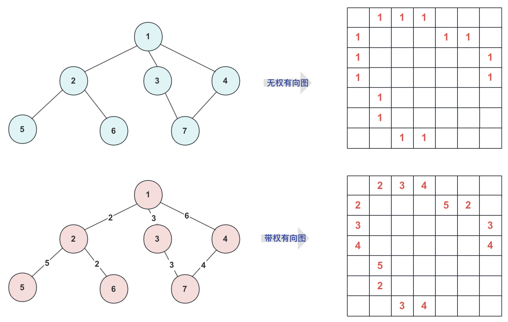
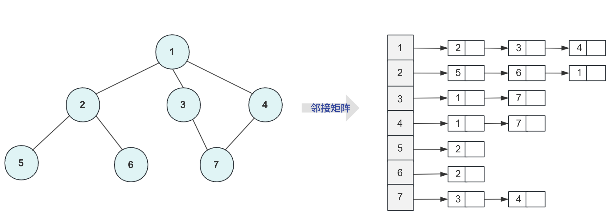
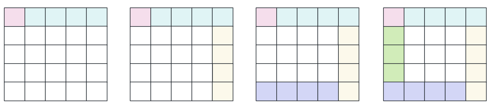
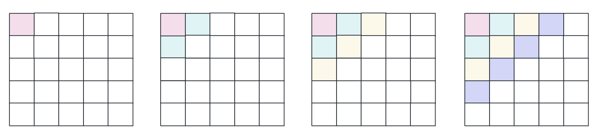

### 前言

当提及常见算法时，深度优先搜索（DFS）和广度优先搜索（BFS）必然名列其中。许多学习者一旦掌握了DFS和BFS，就似乎对算法了如指掌，确实如此。掌握了这两个算法，就能利用计算机强大的计算能力迅速求解大多数问题，好多算法虽然搜索不是最优解，但也为一种极佳选择。

回溯算法，作为五大经典算法之一，实际上也是DFS的一种应用。当我们回忆八皇后问题时，就能体会到回溯算法的精髓。尽管DFS和BFS的基础学习思想相对简单，编写模板代码也不是难事，但在此基础上进行灵活变通却常常颇具挑战。

初步学习DFS和BFS的原理相对简单，但要**精通**它们却颇具难度。许多问题在这两者的基础上进行变形和优化，例如在DFS中可能涉及各种剪枝问题，而BFS可能需要考虑许多贪心策略，还可能涉及到记忆化、双向BFS、BFS+DFS等复杂技巧。然而，本文主要介绍基础概念，更深层次的探讨需要通过刷题实践来学习。

### 邻接矩阵和邻接表

DFS和BFS通常用于解决图的行相关问题，因此在深入问题之前，首先需要关注图的存储方式。一般情况下，我们使用邻接矩阵或邻接表来存储图（这里不讨论十字链表、压缩矩阵等空间优化方法）。

**邻接矩阵：** 邻接矩阵是用数组（二维）表示图的一种方式。通常，我们对图中的各个节点进行顺序编号，矩阵中的数值表示图中节点的连接情况或路径长度。

- 无权图：通常使用布尔数组的 0 和 1 表示连接性。
- 有权图：数组的值表示两节点之间的路径长度，0 表示不通。
- 无向图：矩阵对称；有向图：通常非对称。

下面是一个具体例子。虽然这种方式操作更清晰、更便于实现，但**容易导致空间浪费**，因此有些人进行了空间优化，或选择使用邻接表存储图。



**邻接表：**

观察上面的领接矩阵，如果**节点很多但是联通路径很少**，那么就浪费了太多的存储空间，这种情况就更适合邻接表。

邻接表一般是数组套链表，比起邻接矩阵节省不少空间(直接存储联通信息或者路径)，在存储的时候可以根据数据格式要求灵活运用容器(无权图省事一些，有权图可能需要自定义一个Node类型)。

但是正常的无向图**依然会重复浪费一半空间**，就有十字链表，多重链接表等等出现优化(大佬们的优化是真的牛批)，但在算法逻辑上稍复杂，不过一般图论算法更注重的是算法的优化这里就不介绍十字链表了(虽然我也忘了)，一个邻接表存储的图可以看下图：



### 深度优先搜索 (DFS)

**概念**：

深度优先搜索（DFS）是一种图算法，英文缩写为DFS，即Depth First Search。其核心思想是通过递归深入每个可能的分支路径直至无法深入，每个节点只能访问一次。

如果在迷宫中dfs那么dfs部分路径如下：



简单来说，DFS就是在图中按照一定规则进行搜索，通常通过递归实现。DFS就像一种黑魔法，设计好算法后它自动进行搜索。在使用DFS时，需要关注算法初始化、搜索规则、以及结束条件。一个最简单的DFS就是二叉树的前序遍历，也是很多人第一次接触到的DFS。

我们通常使用邻接表或邻接矩阵来存储图的信息，这里的例子使用邻接矩阵。

DFS的基本流程可以概括为：

1. 从某个节点开始，按照一个方向一直遍历到尽头，同时标记已经访问过的节点。
2. 遍历到尽头后，回退到上一个节点，同时清除当前节点的标记。然后在下一个方向遍历一次，重复步骤1。
3. 一直重复以上流程，直到所有路径都被探索完毕，即回退到起点。

在遍历过程中，记得标记已访问的节点，因为不进行标记可能会陷入死循环。标记表示该点已被使用，而清除标记则说明该点可以重新使用。

**举例说明**：

考虑全排列问题，如字符串 "sai" 的全排列。在DFS中，当枚举到 "s" 时，要标记 "s" 不能再使用（不可能一直 "ssss" 下去），遍历到 "s a" 时，"a" 也不能使用。到 "sai" 时到达尽头，回退到 "s a" 时，要回退 "s"，此时 "a" 和 "i" 被解，但是上次指标方向为 "a"（for循环到的位置），下一次要往下一个方向 "i" 组成 "s i"，然后 "s i a"，依次类推。回退到 "s i" 时，再回退到 "s"，下面两个方向都已经枚举过，继续回退。解放了 "s a i"，但是第一个方向 "s" 已经走过，从 "a" 开始剩下的步骤依次类推。

在标记时，可以使用boolean数组，true 表示已使用，false 表示未使用。除此之外，也可以使用动态数组List，在使用前删除对应位置元素向下递归，结束后再插入，但效率较低，不推荐使用。

对于上面图片中图的DFS，得到其中一个**DFS搜索的序列(可能有多个)**可以用代码来表示一下：

```java
public class DFSDemo {
    static boolean isVisit[];
    public static void main(String[] args) {
        int map[][]=new int[7][7];
        isVisit=new boolean[7];
        map[0][1]=map[1][0]=1;
        map[0][2]=map[2][0]=1;
        map[0][3]=map[3][0]=1;

        map[1][4]=map[4][1]=1;
        map[1][5]=map[5][1]=1;
        map[2][6]=map[6][2]=1;
        map[3][6]=map[6][3]=1;

        isVisit[0]=true;
        DFS(0,map);//从0开始遍历
    }
    private static void DFS(int index,int map[][]) {
        // TODO Auto-generated method stub
        System.out.println("访问"+(index+1));
        for(int i=0;i<map[index].length;i++){//查找联通节点
            if(map[index][i]>0&&isVisit[i]==false){
                isVisit[i]=true;
                DFS(i,map);
            }
        }
    }
}
```
结合上面的图，大致顺序访问为
```
访问1
访问2
访问5
访问6
访问3
访问7
访问4
```


### 广度优先搜索 (BFS)

**概念**：

广度优先搜索（BFS），英文全称为Breadth First Search，是一种不使用经验法则的算法。在该算法中，通过将展开的节点加入到先进先出的队列中，实现对所有可能的子节点的逐层遍历。在典型的实现中，尚未检查的邻居节点被放置在一个称为 "open" 的容器中（例如队列或链表），而已检查过的节点则被放置在 "closed" 容器中。

简单来说，BFS是一种按层遍历的算法，利用队列一层一层地遍历。初次接触BFS可能是在学习数据结构的二叉树层序遍历，之后在图论学习中会遇到更多应用场景。

从路径的角度来看，DFS像一只快速奔跑的疯狗，四处乱咬，走到尽头了就返回其他地方继续；而BFS则像一团毒气，慢慢地扩散开来。



在实现上，朴素的BFS通过控制一个队列，后进先出，进行层序遍历。对于带权值的节点，可能需要使用优先队列。以下是使用邻接表实现BFS遍历的例子：

```java
import java.util.ArrayDeque;
import java.util.ArrayList;
import java.util.List;
import java.util.Queue;

public class BFSDemo {
    public static void main(String[] args) {
        List<Integer>[] adjacencyList = new ArrayList[7];
        boolean[] isVisited = new boolean[7];

        for (int i = 0; i < adjacencyList.length; i++) {
            adjacencyList[i] = new ArrayList<>();
        }

        adjacencyList[0].add(1); adjacencyList[0].add(2); adjacencyList[0].add(3);
        adjacencyList[1].add(0); adjacencyList[1].add(4); adjacencyList[1].add(5);
        adjacencyList[2].add(0); adjacencyList[2].add(6);
        adjacencyList[3].add(0); adjacencyList[3].add(6);
        adjacencyList[4].add(1);
        adjacencyList[5].add(1);
        adjacencyList[6].add(2); adjacencyList[6].add(3);

        Queue<Integer> queue = new ArrayDeque<>();
        queue.add(0);
        isVisited[0] = true;

        while (!queue.isEmpty()) {
            int currentVertex = queue.poll();
            System.out.println("访问" + (currentVertex + 1));

            for (int i = 0; i < adjacencyList[currentVertex].size(); i++) {
                int neighborIndex = adjacencyList[currentVertex].get(i);
                if (!isVisited[neighborIndex]) {
                    queue.add(neighborIndex);
                    isVisited[neighborIndex] = true;
                }
            }
        }
    }
}
```

以上代码使用邻接表实现了一个简单的BFS遍历。在BFS中，使用队列实现先进先出的特性，确保每一层的节点都被遍历。

遍历的结果为：

```
访问1
访问2
访问3
访问4
访问5
访问6
访问7
```


### 双向BFS

BFS当数据达到一定程度，我们使用简单的方法肯定会爆炸的。就可能需要一些特殊的巧妙方法处理，比如剪枝优化、优先队列、A*、DFS套BFS，又或者利用一些非常厉害的数学方法比如康托展开(逆展开)等等。而今天在这里，我们谈谈**双向BFS**，体验一下算法的奥妙！

**适用场景**：

双向广度优先搜索适用于一些问题的拆分，比如在一个迷宫中从左上角到右下角有多少种路径。正常情况下，对整个迷宫进行搜索的复杂度是指数级别的。而通过双向BFS，我们可以将问题拆分为两部分，减少搜索的次数。

**原理**：

对于一个n x n的迷宫，我们可以将其按照对角线拆分为两个部分。即从左上角到中点的次数为n1，从中点到右下角的次数为n2。总的次数就是n1 * n2。通过这种方式，我们通过乘法减少了加法的运算次数，从而提高了效率。

**简单示例**：

考虑一个18 x 18的迷宫。如果直接进行全图搜索，复杂度大约是2^18。而使用双向BFS，我们将迷宫拆分成两个9 x 9的部分，总复杂度为2^9，大约是前者的平方根。

**优化效果**：

从搜索次数的角度来看，如果直接搜索全图的次数是n1 * n2，而使用双向BFS的次数是n1 + n2。如果n1和n2在1000左右，那么两者之间的差距就是平方根级别的。从搜索图形的角度来看，一次全图搜索相当于将一个n x n大小的迷宫转化为n次搜索，每次搜索大约是(n/2) x (n/2)大小的迷宫。因此，如果使用双向BFS，大约是n次搜索，每次搜索是(n/2) x (n/2)大小的迷宫。

**总结**：

双向广度优先搜索通过问题的拆分，减少了搜索的次数，从而提高了搜索效率。在一些大规模问题中，这种优化方法能够显著降低时间复杂度。


**例题实战**一下，就拿一道经典双向BFS问题给大家展示一下吧！ 

题目链接：[http://oj.hzjingma.com/contest/problem?id=20&pid=8#problem-anchor](http://oj.hzjingma.com/contest/problem?id=20&pid=8#problem-anchor)


**分析**：对于题目的要求还是很容易理解的，就是找到所有的**路径种类**，再判断其中是**对称路径**的有几个输出即可！

对于一个普通思考是这样的，首先是进行DFS，然后动态维护一个字符串，每次跑到最后判断这个路径字符串是否满足对称要求，如果满足那么就添加到容器中进行判断。可惜很遗憾这样是超时的，仅能通过40%的样例。

接着用普通BFS进行尝试，维护一个node节点，每次走的时候路径储存起来其实这个效率跟DFS差不多依然超时。只能通过40%数据。

**接下来就开始双向BFS进行分析**！

(1) 既然只能右下，那么对角线的那个位置的肯定是中间的那个字符串的！**它的存在不影响是否对称的**(n*n的迷宫路径长度为`n-1 + n`为奇数).

(2) 我们判断路径是否对称，只需要判断从`(1,1)到对角节点k`(设为k节点)的路径**有没有和**从`(n,n)到k`相同的。**如果有路径相同的那么就说明这一对构成对称路径**

(3) **在具体实现上**，我们对**每个对角线节点**可以进行两次BFS(一次左上到(1,1),一次右下到(n,n)).并且将路径放到两个hashset(set1,set2)中，跑完之后用遍历其中一个hashset中的路径，看看另一个set是否存在该路径，如果存在就说明这个是对称路径放到 **总的hashset(set) 中**。对角线每个位置都这样判断完最后只需要输出总的hashset(set)的集合大小即可！


ac代码如下：

```java
import java.util.ArrayDeque;
import java.util.HashSet;
import java.util.Queue;
import java.util.Scanner;
import java.util.Set;

public class test2 {	
	static class node{
		 int x;
		 int y;
		String path="";
		public node() {}
		public node(int x,int y,String team)
		{
			this.x=x;
			this.y=y;
			this.path=team;
		}
	}
	public static void main(String[] args) {
		Scanner sc=new Scanner(System.in);
		Set<String>set=new HashSet<String>();//储存最终结果
		int n=Integer.parseInt(sc.nextLine());
		char map[][]=new char[n][n];
		for(int i=0;i<n;i++)
		{
			String string=sc.nextLine();
			map[i]=string.toCharArray();
		}
		Queue<node>q1=new ArrayDeque<node>();//左上的队列
		Queue<node>q2=new ArrayDeque<node>();//右下的队列
		for(int i=0;i<n;i++)
		{
			q1.clear();q2.clear();
			Set<String>set1=new HashSet<String>();//储存zuoshang
			Set<String>set2=new HashSet<String>();//储右下
			q1.add(new node(i,n-1-i,""+map[i][n-1-i]));
			q2.add(new node(i,n-1-i,""+map[i][n-1-i]));
			while(!q1.isEmpty()&&!q2.isEmpty())
			{
				node team=q1.poll();
				node team2=q2.poll();
				if(team.x==n-1&&team.y==n-1)//到终点，将路径储存
				{
					//System.out.println(team2.path);	
					set1.add(team.path);
					set2.add(team2.path);
				}
				else {
					if(team.x<n-1)//可以向下
					{
						q1.add(new node(team.x+1, team.y, team.path+map[team.x+1][team.y]));
					}
					if(team.y<n-1)//可以向右
					{
						q1.add(new node(team.x, team.y+1, team.path+map[team.x][team.y+1]));
					}
					if(team2.x>0)//上
					{
						q2.add(new node(team2.x-1, team2.y, team2.path+map[team2.x-1][team2.y]));
					}
					if(team2.y>0)//左
					{
						q2.add(new node(team2.x, team2.y-1, team2.path+map[team2.x][team2.y-1]));
					}
				}
				
			}
			for(String va:set1)
			{
				if(set2.contains(va))
				{
					set.add(va);
				}
			}
			
		}
		System.out.println(set.size());		
	}
}

```


### 总结

本文主要任务是帮助初学者认清DFS和BFS，比较偏基础，但是事实中DFS和BFS比较偏向实战。

对于DFS和BFS，有些区别也有些共性，例如在迷宫很多问题DFS能解决BFS也能解决。

对于DFS一般解决的经典问题有：

- 二叉树的搜索遍历
- 经典全排列、组合、子集问题
- 回溯算法之八皇后问题
- 迷宫搜索问题(能否找到)
- 其他图搜索

而BFS一般解决的问题有：

- 二叉树层序搜索遍历(各种变形例如分层输出、之字形等等空间优化)
- 无权图的最短路径
- 其他迷宫搜索问题(节点带某些权值的)
- 其他问题

当然这里面罗列不全，DFS关注更多的可能是**剪枝问题**或者**记忆化**，剪枝就是剪掉没必要的搜索，记忆化就是防止太多重复操作。而BFS关注更多的可能是贪心策略选择(大部分搜索可能有一些附加的条件)可能需要使用优先队列来解决。

DFS和BFS是图论中非常经典的搜索算法，两种算法的重要程度都非常高，这里面主要对其简单介绍，对于普通开发者，能够用DFS和BFS能够解决二叉树问题、迷宫搜索问题等基础简单的就够了(面试官不会那么骚难为你)。

如果理解比较困难，多看教程、多刷题，多刷题之后每做一题算法跑的大概流程是有个数的。
